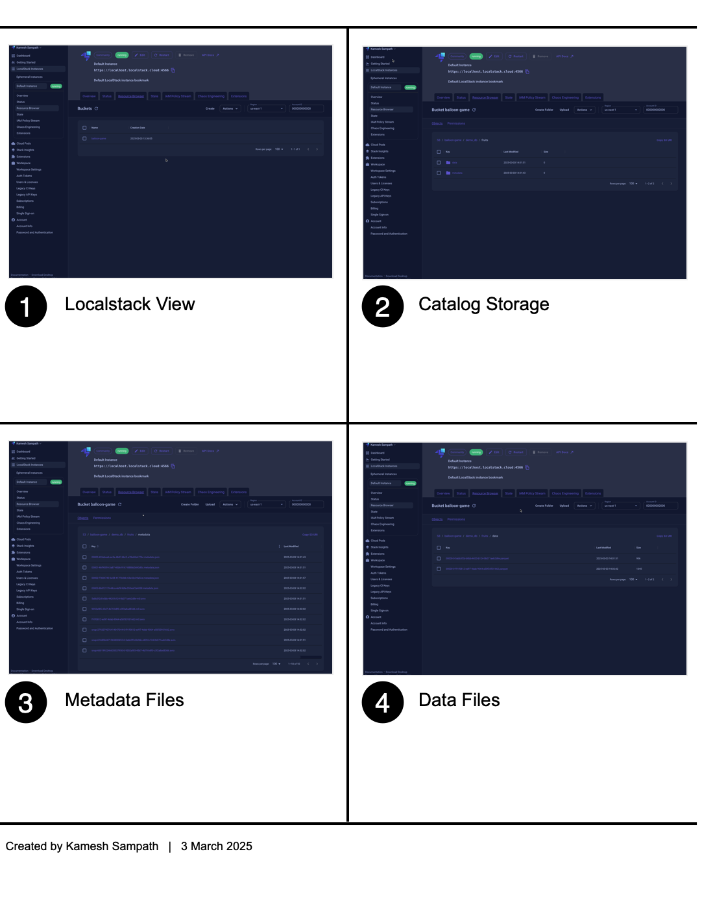

# Setup Iceberg Catalog using Apache Polaris

## Learning Objectives

By the end of this chapter, you will have:

- Created an S3 bucket for Iceberg data storage
- Configured a Polaris Catalog named `balloon-game`
- Set up the `super_user` Principal with the `admin` Principal Role
- Created the Catalog Role `sudo` and assigned it to the Principal Role `admin`
- Granted the `CATALOG_MANAGE_CONTENT` permission to the `sudo` role
- Created the Iceberg database `balloon_pops` for our application

!!! info
    The Polaris server starts with no catalogs configured. We'll set up the first catalog along with the necessary security roles and permissions.

## Understanding Polaris Components

Before we begin, let's clarify the key components we'll be setting up:

- **Catalog**: A top-level container that manages Iceberg tables and their metadata
- **Principal**: A user identity that can access the catalog
- **Principal Role**: A collection of permissions assigned to principals
- **Catalog Role**: A role specific to a catalog that defines what actions can be performed
- **Grants**: Permissions assigned to roles

## Creating the Catalog Infrastructure

Run the following command to create the entire catalog infrastructure:

```shell
ansible-playbook $PROJECT_HOME/polaris-forge-setup/catalog_setup.yml
```

!!! note
    All configuration values can be customized by modifying the [defaults/main.yml](https://github.com/kameshsampath/balloon-popper-demo/blob/main/polaris-forge-setup/defaults/main.yml){target=_blank} file.

### What Happens During Setup

The playbook performs these key operations:

1. Creates an S3 bucket named `balloon-game` for storing Iceberg data
2. Configures the Polaris catalog with the same name
3. Sets up the `super_user` principal for administration
4. Creates the `admin` principal role and assigns it to `super_user`
5. Creates the `sudo` catalog role with elevated permissions
6. Grants the `CATALOG_MANAGE_CONTENT` permission to the `sudo` role
7. Creates the `balloon_pops` database for our application data

!!! warning
    The playbook temporarily modifies your environment variables for AWS connectivity:
    ```shell
    unset AWS_PROFILE # avoids collision with existing AWS profiles
    export AWS_ENDPOINT_URL=http://localstack.localstack:4566
    export AWS_ACCESS_KEY_ID=test
    export AWS_SECRET_ACCESS_KEY=test
    export AWS_REGION=us-east-1
    ```
    These settings ensure proper connection to the LocalStack environment.

## Verifying the Setup

To confirm that everything is working correctly:

1. Run the verification notebook:
   ```shell
   jupyter notebook $PROJECT_HOME/notebooks/verify_polaris.ipynb
   ```

2. The notebook will create a test namespace, table, and insert sample data.

3. You can also verify the S3 bucket contents by opening the LocalStack web interface at [https://app.localstack.cloud/inst/default/resources/s3/balloon-game?prefix=demo_db](https://app.localstack.cloud/inst/default/resources/s3/balloon-game?prefix=demo_db).

   You should see something similar to this:

   

!!! success "Next Steps"
    Now that you have set up the Polaris catalog infrastructure, you're ready to create the schema definitions for your Iceberg tables in the next chapter.