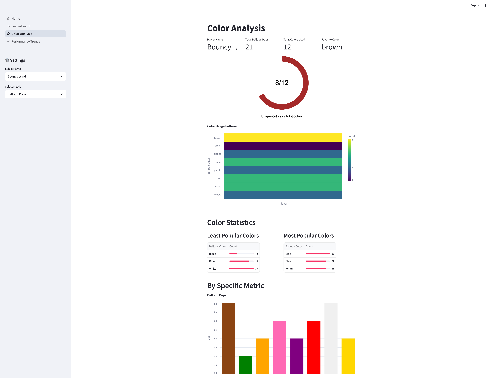
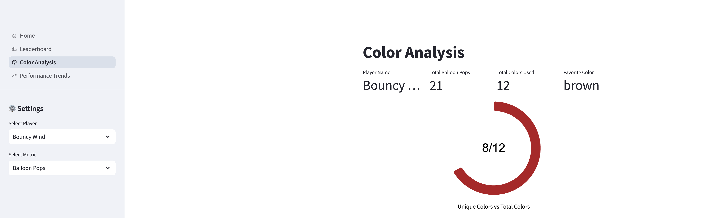
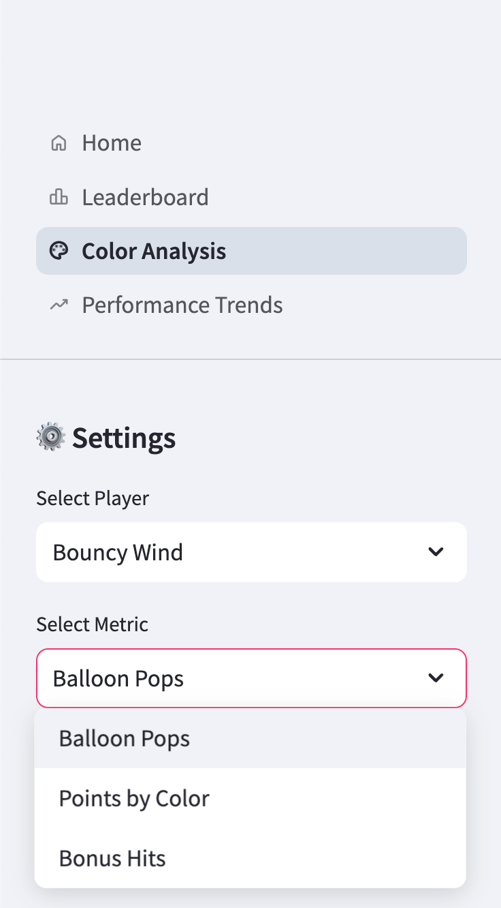
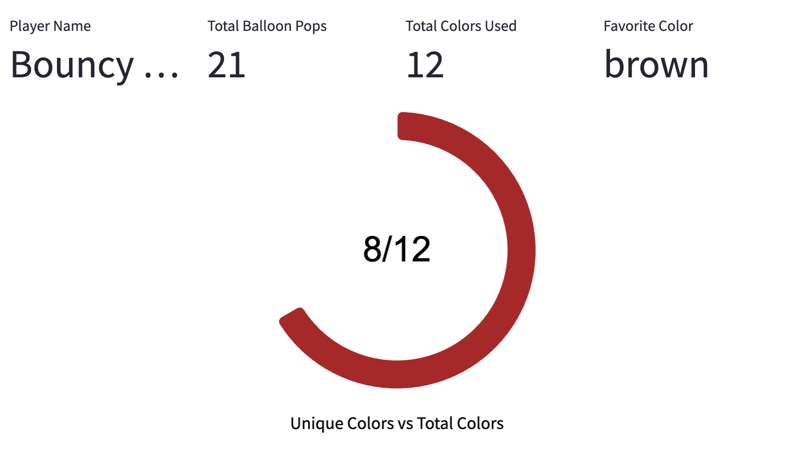

# Color Analysis Dashboard

The Color Analysis dashboard provides detailed insights into players' balloon color preferences and performance metrics across different colors in the game.

!!! info "Dashboard Purpose"
    This dashboard helps analyze player behavior patterns related to balloon colors, identifying favorite colors, usage statistics, and performance metrics by color.

The complete code for this dashboard is available on GitHub: [balloon-popper-demo/color_analysis.py](https://github.com/kameshsampath/balloon-popper-demo/blob/main/packages/dashboard/src/dashboard/pages/color_analysis.py)


*Figure 1: Full view of the Color Analysis Dashboard showing player statistics and color patterns*

## Overview

The Color Analysis dashboard provides several key components:

1. **Player Summary Statistics**: Key metrics about a player's balloon popping behavior
2. **Color Usage Patterns**: Visual representation of color preferences
3. **Color Distribution**: Heatmap showing the distribution of balloon colors
4. **Color-specific Metrics**: Performance metrics broken down by balloon color

## Technical Implementation

This dashboard leverages:

- **Streamlit**: For creating the interactive interface
- **Altair**: For generating the specialized visualizations
- **Pandas**: For data manipulation and analysis

```python
# Summary statistics display with multiple columns
col1, col2, col3, col4 = st.columns(4)
favorite_color = analyze_balloon_stats(colored_pops, selected_player)[0]
with col1:
    st.metric("Player Name", selected_player)
with col2:
    st.metric("Total Balloon Pops", colored_pops[colored_pops['player'] == selected_player]['balloon_pops'].sum())
with col3:
    st.metric("Total Colors Used", colored_pops['balloon_color'].nunique())
with col4:
    st.metric("Favorite Color", favorite_color)
```


*Figure 2: Player summary statistics showing key metrics at a glance*

## Interactive Features

The dashboard includes several interactive elements for customized analysis:

### Player Selection

Users can select specific players to analyze their color preferences and statistics:

```python
# Player selector in sidebar
players = sorted(colored_pops["player"].unique())
selected_player = st.sidebar.selectbox(
    "Select Player",
    options=players,
)
```

### Metric Selection

> Users can choose from different metrics to analyze performance by color.

```python
# Metric selector
metrics = {
    "Balloon Pops": "balloon_pops",
    "Points by Color": "points_by_color",
    "Bonus Hits": "bonus_hits",
}
selected_metric = st.sidebar.selectbox("Select Metric", list(metrics.keys()))
```


*Figure 3: Sidebar controls for selecting players and metrics*

## Data Visualizations

The dashboard includes several specialized visualizations:

### Color Usage Gauge

This visualization shows the player's color variety usage compared to total available colors:

```python
# Create gauge visualization for color usage
gauge_data = pd.DataFrame({
    'value': [_unique_colors],
    'max_value': [total_colors],
    'display': [f"{_unique_colors}/{total_colors}"]
})

arc = base.mark_arc(
    innerRadius=100,
    cornerRadius=5,
    stroke="#fff"
).encode(
    color=alt.value(gauge_color)
)

text = base.mark_text(
    align='center',
    baseline='middle',
    fontSize=32,
    font='Arial'
).encode(
    text='display:N'
)
```


*Figure 4: Gauge chart showing unique colors used versus total available colors*

### Color Distribution Heatmap

!!! example "Color Distribution Visualization"
    ```python
    # Color distribution heatmap
    color_dist = (_filtered_df.groupby(['player', 'balloon_color'])
                .size()
                .astype(int)
                .reset_index(name='count'))

    heatmap = alt.Chart(color_dist).mark_rect().encode(
        x=alt.X('player:N',
                title='Player',
                axis=alt.Axis(labels=False)),
        y=alt.Y('balloon_color:N', title='Balloon Color'),
        color=alt.Color('count:Q',
                        scale=alt.Scale(scheme=st.session_state.color_scheme),
                        legend=alt.Legend(format='d', values=sorted(color_dist['count'].unique()), )),
        tooltip=['player', 'balloon_color',
                alt.Tooltip('count:Q', format=',d')]
    )
    ```


*Figure 5: Heatmap showing distribution and frequency of balloon colors*

### Color-specific Metrics Chart

The dashboard visualizes performance metrics by color with an interactive bar chart:

```python
# Base chart for color-specific metrics
base_chart = alt.Chart(ca_filtered_df).mark_bar().encode(
    x=alt.X('balloon_color:N',
            title=None,
            axis=alt.Axis(labels=False, ticks=False)),
    y=alt.Y(f'sum({ca_selected_metric}):Q',
            title='Total'),
    color=alt.Color('balloon_color:N',
                    scale=alt.Scale(domain=list(color_map.keys()),
                                    range=list(color_map.values())),
                    legend=None),
    tooltip=[
        alt.Tooltip('balloon_color:N', title='Color'),
        alt.Tooltip(f'sum({ca_selected_metric}):Q',
                    title=metric_titles[ca_selected_metric],
                    format=',.0f')
    ]
)
```


*Figure 6: Bar chart showing performance metrics broken down by balloon color*

## Color Statistics

The dashboard includes detailed statistics on color popularity:

```python
stat_col1, stat_col2 = st.columns(2)
with stat_col1:
    # Least used colors
    least_used = colored_pops['balloon_color'].value_counts().nsmallest(3)
    st.write("### Least Popular Colors")
    least_used_df = to_df(least_used, ['balloon_color', 'count'])
    least_used_df['balloon_color'] = least_used_df['balloon_color'].str.title()
    st.dataframe(
        least_used_df,
        column_config={
            "balloon_color": st.column_config.TextColumn(
                label="Balloon Color",
                help="Balloon Color",
            ),
            "count": st.column_config.ProgressColumn(
                "Count",
                help=f"Count of the least popular color for the player {selected_player}",
                format="%d",
                min_value=0,
                max_value=int(least_used_df['count'].max())
            )
        },
        hide_index=True
    )
```


*Figure 7: Data tables showing most and least popular balloon colors*

## Data Processing

The dashboard performs several key data transformations:

1. **Color preference analysis**:
   ```python
   # Favorite colors (most popped)
   color_counts = _filtered_df.groupby(['player', 'balloon_color']).size().reset_index(name='count')
   favorite_colors = color_counts.sort_values('count', ascending=False).groupby('player').first()
   ```

2. **Color usage pattern analysis**:
   ```python
   # Unique colors used by each player
   _unique_colors = df[df['player'] == selected_player]['balloon_color'].nunique()
   total_colors = df['balloon_color'].nunique()  # Total possible colors
   ```

!!! warning "Color Mapping"
    The dashboard relies on the `color_map` dictionary to correctly map color names to their visual representation. Ensure this mapping is kept up-to-date if new balloon colors are added to the game.

## Insights and Applications

This dashboard enables several types of analysis:

- **Player Color Preferences**: Identify which colors each player tends to favor
- **Difficulty Analysis**: Determine if certain colors are consistently ignored or targeted
- **Performance Optimization**: See which colors yield the highest points or bonus hits
- **Game Balance**: Evaluate if the color distribution is balanced across gameplay

---

*The Color Analysis dashboard provides valuable insights into player behavior patterns and preferences, helping game designers optimize the gaming experience.*