# Balloon Popper Game Analytics: A Streaming Data Demo

## Overview

This demonstration showcases a complete streaming analytics pipeline that processes real-time data from a balloon popping game. The project illustrates modern data architecture patterns by combining stream processing with data lake storage and interactive visualizations, providing end-to-end analytics capabilities from data generation to actionable insights.

## Architecture

```mermaid
flowchart TD
    %% Define subgraphs for layers
    subgraph K8s["Kubernetes Cluster"]
        subgraph Generation["Data Generation"]
            EventGen["Event Generator\n(Balloon Pop Events)"]
            PyGen["Python Generator\n(Simulated Game Data)"]
        end

        subgraph Streaming["Data Streaming"]
            Kafka["Apache Kafka\n(Strimzi Operator)"]
        end

        subgraph Processing["Stream Processing"]
            RisingWave["RisingWave\nSQL Stream Processing"]
            MatViews["Materialized Views\nReal-time Aggregations"]
        end

        subgraph Storage["Data Storage & Visualization"]
            Polaris["Apache Polaris\nREST Catalog"]
            LocalStack["LocalStack\nS3 Storage"]
            Iceberg["Apache Iceberg\nTable Format"]
            Streamlit["Streamlit\nDashboard"]
            Jupyter["Jupyter\nNotebooks"]
        end
        
        subgraph Dashboards["Analytics Dashboards"]
            Leaderboard["Leaderboard\nPlayer Rankings"]
            ColorAnalysis["Color Analysis\nBalloon Preferences"]
            Performance["Performance Analysis\nScoring Patterns"]
        end
    end

    %% Define connections
    EventGen --> |Game Events| Kafka
    PyGen --> |Game Events| Kafka
    Kafka --> |Stream Processing| RisingWave
    RisingWave --> |Continuous Queries| MatViews
    RisingWave --> |Sink to Iceberg| Iceberg
    
    %% Metadata connections
    Polaris -.-> LocalStack
    Polaris -.-> Iceberg
    
    %% Storage to visualization
    LocalStack --> Iceberg
    Iceberg --> |Data Access| Streamlit
    Streamlit --> |Visualization| Dashboards
    Iceberg --> |Analysis| Jupyter

    %% Styling
    classDef generationClass fill:#e6f7ff,stroke:#1890ff,stroke-width:2px
    classDef streamingClass fill:#ebf8f2,stroke:#52c41a,stroke-width:2px
    classDef processingClass fill:#fff7e6,stroke:#fa8c16,stroke-width:2px
    classDef storageClass fill:#f9f0ff,stroke:#722ed1,stroke-width:2px
    classDef dashboardClass fill:#fff0f6,stroke:#eb2f96,stroke-width:2px
    
    class EventGen,PyGen generationClass
    class Kafka streamingClass
    class RisingWave,MatViews processingClass
    class Polaris,LocalStack,Iceberg,Streamlit,Jupyter storageClass
    class Leaderboard,ColorAnalysis,Performance dashboardClass
    
    %% Subgraph styling
    style Generation fill:#e6f7ff,stroke:#1890ff,stroke-width:2px
    style Streaming fill:#ebf8f2,stroke:#52c41a,stroke-width:2px
    style Processing fill:#fff7e6,stroke:#fa8c16,stroke-width:2px
    style Storage fill:#f9f0ff,stroke:#722ed1,stroke-width:2px
    style Dashboards fill:#fff0f6,stroke:#eb2f96,stroke-width:2px
    style K8s fill:#f8f9fa,stroke:#dddddd,stroke-width:3px,stroke-dasharray: 5 5
```

## Core Components

### Data Generation
- **Balloon Popper Game**: Generates events when players pop balloons of different colors
- **Kafka**: Streams game events in real-time for immediate processing

### Stream Processing
- **RisingWave**: Processes streaming data with SQL, creating materialized views for analytics
- **Apache Polaris**: Manages Iceberg table metadata via REST catalog service
- **LocalStack S3**: Emulates AWS S3 for local storage of Iceberg data files

### Data Storage
- **Apache Iceberg**: Provides table format for analytics with schema evolution and time travel
- **Data Lake**: Stores processed data for both real-time and historical analysis

### Visualization & Analytics
- **Streamlit Dashboard**: Delivers interactive visualizations of game metrics
- **Altair Charts**: Creates statistical visualizations with declarative syntax
- **Pandas**: Processes and transforms data for visualization and analysis
- **Interactive Dashboards**: Enables user-driven exploration of game data

### Analytics Dashboards
- **Leaderboard Dashboard**: Tracks player rankings and score progression over time
- **Color Analysis Dashboard**: Analyzes player color preferences and interaction patterns
- **Performance Analysis Dashboard**: Measures scoring efficiency with statistical visualizations

## Key Features

### Stream Processing Capabilities
- Real-time aggregations of player scores and balloon pop statistics
- Windowed analytics for time-based performance tracking
- Continuous processing of game events with sub-second latency

### Data Management
- Schema evolution supported through Apache Iceberg
- Merge-on-read optimizations for frequently updated metrics
- Partitioning strategies optimized for different query patterns

### Interactive Analytics
- Live leaderboards showing top-performing players
- Color-specific metrics tracking most valuable balloon types
- Time-series visualizations of game performance trends
- Statistical breakdowns of player behavior patterns
- Performance distribution visualizations using box plots
- Color preference analysis with heatmaps and gauges

## Use Cases Demonstrated

This demo illustrates patterns applicable to various real-world streaming analytics scenarios:

- **Gaming Analytics**: Player behavior, performance tracking, and engagement metrics
- **IoT Data Processing**: Sensor data aggregation and real-time monitoring
- **Financial Services**: Transaction monitoring and fraud detection patterns
- **E-commerce**: Real-time inventory and user behavior tracking
- **Product Analytics**: Feature usage patterns and user engagement metrics
- **Marketing Analytics**: Campaign performance and user segment analysis

## Technology Stack

| Component | Technology | Purpose |
|-----------|------------|---------|
| Event Streaming | Apache Kafka | Real-time data transport |
| Stream Processing | RisingWave | SQL-based stream processing |
| Metadata Management | Apache Polaris | Iceberg REST catalog |
| Storage | Apache Iceberg + S3 | Table format and object storage |
| Data Processing | Pandas | Data transformation and analysis |
| Visualization | Streamlit + Altair | Interactive dashboards and charts |
| Infrastructure | Kubernetes (K3d) | Container orchestration |
| Cloud Emulation | LocalStack | Local AWS service emulation |

## Dashboard Features

| Dashboard | Key Visualizations | Insights Provided |
|-----------|-------------------|-------------------|
| **Leaderboard** | Score trends, player rankings | Player performance, competitive standings |
| **Color Analysis** | Color distribution heatmaps, preference charts | Player color preferences, gameplay patterns |
| **Performance Analysis** | Box plots, bar charts, statistical tables | Scoring efficiency, time-based patterns |

## Getting Started

This tutorial will guide you through:

1. Setting up the local development environment
2. Deploying the necessary infrastructure components
3. Configuring the Apache Polaris catalog and Iceberg tables
4. Running the event generator to produce game data
5. Creating interactive dashboards with Streamlit and Altair
6. Analyzing player behavior and game performance metrics

Let's begin with the environment setup in the next chapter.