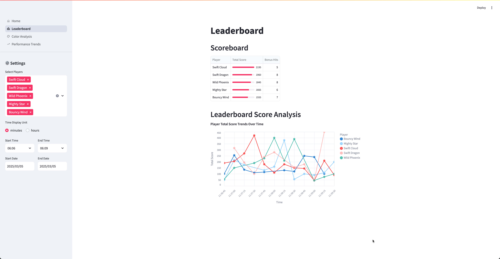
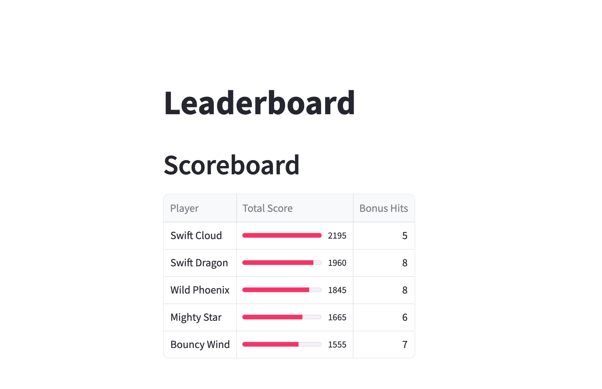
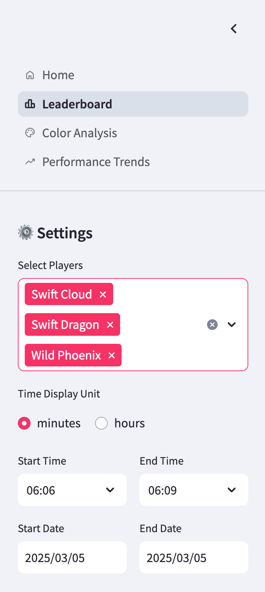
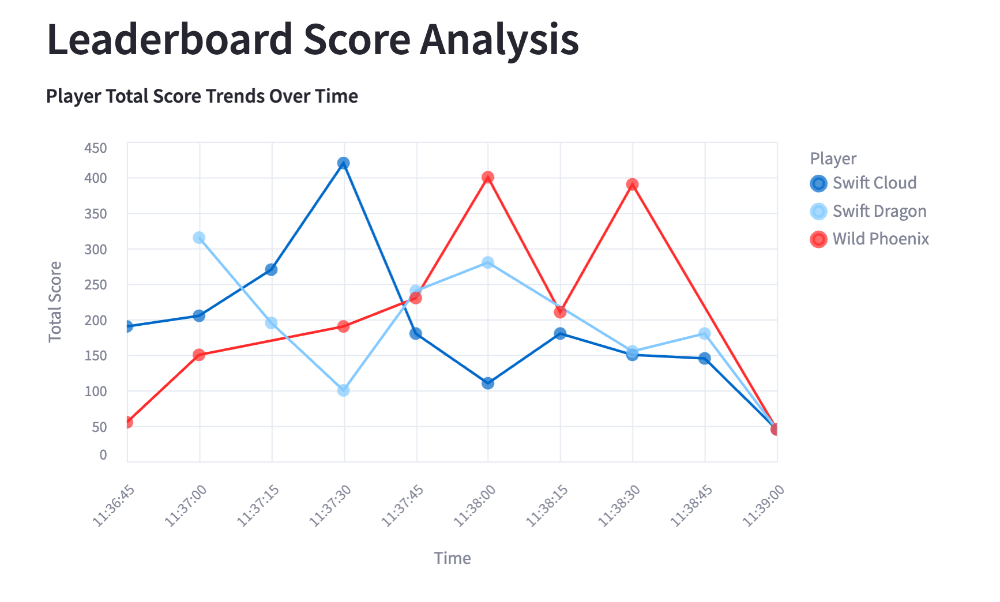

# Leaderboard Dashboard

The leaderboard dashboard provides real-time analytics of player performance using interactive visualizations and filtering options.

!!! info "Dashboard Purpose"
    This dashboard helps game administrators and players track performance metrics, compare top players, and analyze score patterns over specific time periods.

The complete code for this dashboard is available on GitHub: [balloon-popper-demo/leaderboard.py](https://github.com/kameshsampath/balloon-popper-demo/blob/main/packages/dashboard/src/dashboard/pages/leaderboard.py)

## Overview

The dashboard consists of two main components:

1. **Scoreboard**: A tabular view of the top 5 players with visual indicators
2. **Score Trends**: An interactive time-series chart showing how scores evolve


*Figure 1: Full view of the Leaderboard Dashboard showing the scoreboard and score trends*

## Technical Implementation

We've built this dashboard using a powerful combination of tools:

- **Streamlit**: For the interactive web interface
- **Altair**: For data visualizations
- **Pandas**: For data processing and analysis

```python
st.title("Leaderboard")

# Display top players with visual progress bars
st.dataframe(
    combined_stats.head(5),
    column_config={
        "player": "Player",
        "total_score": st.column_config.ProgressColumn(
            "Total Score",
            help="Player's total score with visual progress bar",
            format="%d",
            min_value=0,
            max_value=int(combined_stats["total_score"].max()),
        ),
        "bonus_hits": st.column_config.NumberColumn(
            "Bonus Hits",
            help="Player's bonus hits",
            format="%d",
        ),
    },
    hide_index=True,
)
```


*Figure 2: The Scoreboard component with progress bars for visual comparison*

## Interactive Features

The dashboard includes several interactive elements to enhance the analysis experience:

### Player Selection

> Users can select specific players to focus their analysis on particular competitors of interest.

```python
selected_players = st.sidebar.multiselect(
    "Select Players",
    options=leaders,
    default=leaders,
)
```

### Time Range Filtering

!!! tip "Time Analysis"
    Filtering by time range allows you to analyze performance during specific game sessions or events.

```python
# Time range selection with date and time pickers
col1, col2 = st.sidebar.columns(2)

with col1:
    start_time = st.time_input(
        "Start Time", value=pd.to_datetime(min_time).time()
    )
    start_date = st.date_input(
        "Start Date",
        value=pd.to_datetime(min_time).date(),
        min_value=pd.to_datetime(min_time).date(),
        max_value=pd.to_datetime(max_time).date(),
    )
```

### Time Unit Selection

Users can toggle between different time display units:

```python
time_unit = st.sidebar.radio(
    "Time Display Unit", options=["minutes", "hours"], horizontal=True
)
```



*Figure 4: Sidebar controls for filtering and customizing the dashboard view*

## Data Visualization

The score trend visualization combines multiple visual elements:

!!! example "Score Trend Chart"
    ```python
    # Create lines
    lines = base.mark_line()

    # Create interactive points with tooltips
    points = base.mark_circle(size=100).encode(
        tooltip=[
            alt.Tooltip("player:N", title="Player"),
            alt.Tooltip("total_score:Q", title="Total Score", format=".0f"),
            alt.Tooltip("window_start:T", title="Time", format=time_format),
        ]
    )

    # Combine for richer visualization
    chart = (
        (lines + points)
        .properties(width=700, height=400, title="Player Total Score Trends Over Time")
        .interactive()
    )
    ```


*Figure 3: Interactive score trends chart showing player performance over time*

## Data Processing

The dashboard performs several key data transformations behind the scenes:

1. **Time-based filtering**:
   ```python
   filtered_df = filter_data_by_time(realtime_scores_df, start_datetime, end_datetime)
   ```

2. **Score aggregation**:
   ```python
   aggregated_df = (
       filtered_df.groupby(["window_start", "player"])["total_score"]
       .max()
       .reset_index()
   )
   ```

!!! warning "Performance Consideration"
    For large datasets, the time-based filtering and aggregation operations may impact dashboard performance. Consider implementing data pre-aggregation for production deployments.

## Customization Options

This dashboard can be extended in several ways:

- Add additional metrics beyond total score and bonus hits
- Implement player performance comparison features
- Create historical trend analysis across game sessions

---

*This dashboard is part of the game analytics suite and provides valuable insights for both administrators and players.*