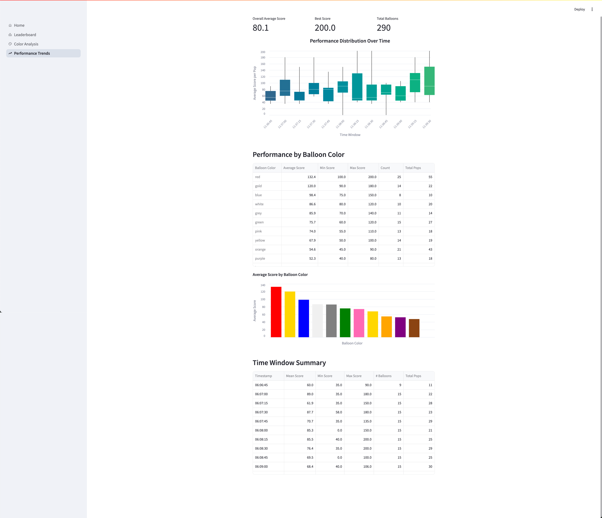
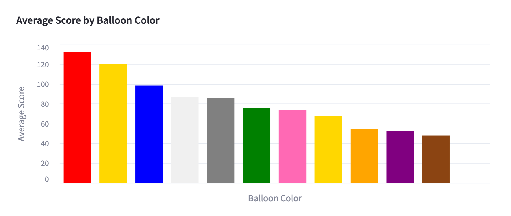
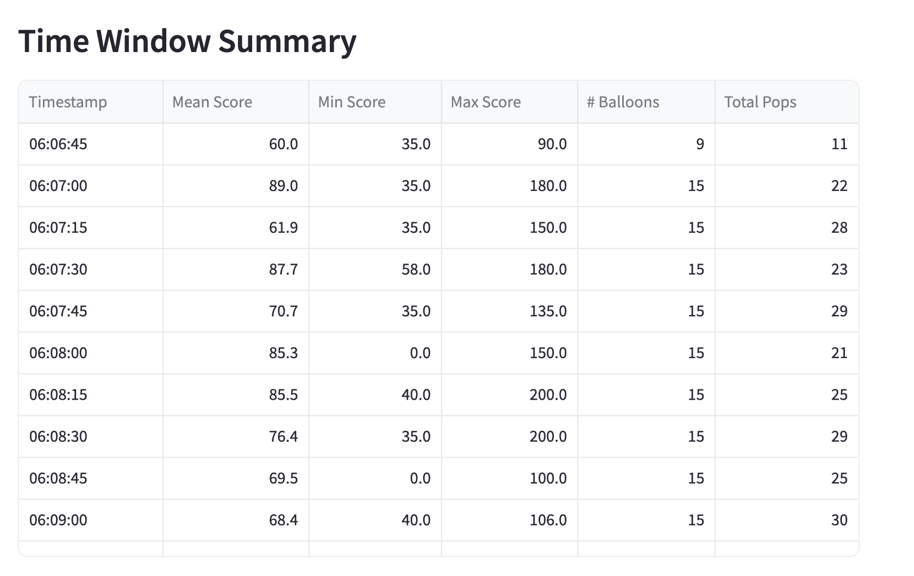

# Balloon Performance Analysis Dashboard

This dashboard provides detailed analytics about balloon popping performance over time and across different balloon colors, giving insights into scoring patterns and efficiency.

!!! info "Dashboard Purpose"
    This dashboard helps track performance metrics over time, analyze scoring efficiency, and identify patterns in balloon popping performance across different colors.

The complete code for this dashboard is available on GitHub: [balloon-popper-demo/performance_trends.py](https://github.com/kameshsampath/balloon-popper-demo/blob/main/packages/dashboard/src/dashboard/pages/performance_trends.py)


*Figure 1: Full view of the Performance Analysis Dashboard showing performance distributions and color-based metrics*

## Overview

The Performance Analysis dashboard focuses on these key areas:

1. **Performance Summary**: Key metrics including overall average score, best score, and total balloons popped
2. **Time-based Distribution**: Box plots showing score distribution over time periods
3. **Color-based Performance**: Analysis of scoring efficiency across different balloon colors
4. **Time Window Summary**: Detailed metrics for 15-second time intervals

## Technical Implementation

This dashboard uses:

- **Streamlit**: For the interactive interface and data display components
- **Altair**: For creating statistical visualizations like box plots and bar charts
- **Pandas**: For time-series analysis and data aggregation

```python
# Summary statistics display with multiple columns
def show_summary(df):
    col1, col2, col3 = st.columns(3)
    with col1:
        st.metric("Overall Average Score",
                  f"{df['avg_score_per_pop'].mean():.1f}")
    with col2:
        st.metric("Best Score",
                  f"{df['avg_score_per_pop'].max():.1f}")
    with col3:
        st.metric("Total Balloons",
                  f"{df['total_pops'].sum()}")
```


*Figure 2: Summary metrics showing overall performance statistics*

## Data Visualizations

The dashboard includes several specialized visualizations to analyze performance from different angles:

### Performance Distribution

The main visualization shows performance distribution over time using box plots:

```python
# Main box plot
main_chart = alt.Chart(performance_trends_df).mark_boxplot(
    extent='min-max',
    median=dict(color='white'),
    size=40
).encode(
    x=alt.X('window_start:T',
            title='Time Window',
            axis=alt.Axis(format='%H:%M:%S', labelAngle=-45)),
    y=alt.Y('avg_score_per_pop:Q',
            title='Average Score per Pop',
            scale=alt.Scale(zero=False)),
    color=alt.Color('window_start:T',
                    legend=None,
                    scale=alt.Scale(scheme='viridis')),
    tooltip=[
        alt.Tooltip('window_start:T', title='Time Window', format='%H:%M:%S'),
        alt.Tooltip('avg_score_per_pop:Q', title='Score', format='.1f'),
        alt.Tooltip('total_pops:Q', title='Total Pops')
    ]
)
```


*Figure 3: Box plots showing score distribution over different time windows*

### Color Performance Analysis

!!! example "Color-based Performance Chart"
    ```python
    # Create color performance chart
    color_chart = alt.Chart(performance_trends_df).mark_bar().encode(
        x=alt.X('balloon_color:N',
                title='Balloon Color',
                sort='-y',
                axis=alt.Axis(labels=False)),
        y=alt.Y('mean(avg_score_per_pop):Q',
                title='Average Score'),
        color=alt.Color('balloon_color:N',
                        legend=None,
                        scale=alt.Scale(domain=list(color_map.keys()),
                                        range=list(color_map.values()))),
        tooltip=[
            alt.Tooltip('balloon_color:N', title='Color'),
            alt.Tooltip('mean(avg_score_per_pop):Q', title='Avg Score', format='.1f'),
            alt.Tooltip('count():Q', title='Count')
        ]
    )
    ```


*Figure 4: Bar chart showing average score performance by balloon color*

## Statistical Summaries

The dashboard provides detailed statistical tables for both color-based and time-based performance:

### Color Statistics Table

```python
# Calculate color-based statistics
color_stats = performance_trends_df.groupby('balloon_color').agg({
    'avg_score_per_pop': ['mean', 'min', 'max', 'count'],
    'total_pops': 'sum'
}).round(1)

color_stats.columns = ['Average Score', 'Min Score', 'Max Score', 'Count', 'Total Pops']
color_stats = color_stats.sort_values('Average Score', ascending=False)

# Display color statistics with configured columns
st.dataframe(
    color_stats,
    column_config={
        "balloon_color": st.column_config.TextColumn(
            label="Balloon Color",
            help="Color of the balloon"
        ),
        "Average Score": st.column_config.NumberColumn(
            label="Average Score",
            help="Mean score for this color",
            format="%.1f",
            min_value=0
        ),
        # Additional column configurations...
    },
    hide_index=False  # Show balloon color as index
)
```


*Figure 5: Detailed statistics table showing performance metrics by balloon color*

### Time Window Summary

> The time window summary provides detailed metrics for 15-second intervals, helping identify performance patterns over time.

```python
# Time window summary with 15-second intervals
time_summary = performance_trends_df.groupby(pd.Grouper(key='window_start', freq='15S')).agg({
    'avg_score_per_pop': ['mean', 'min', 'max', 'count'],
    'total_pops': 'sum'
}).round(1)

# Rename columns
time_summary.columns = ['Mean Score', 'Min Score', 'Max Score', '# Balloons', 'Total Pops']
```


*Figure 6: Time-based performance summary showing metrics for 15-second intervals*

## Data Processing

The dashboard performs several important data transformations:

1. **Time-based aggregation**:
   ```python
   # Group data into 15-second intervals
   time_summary = performance_trends_df.groupby(pd.Grouper(key='window_start', freq='15S'))
   ```

2. **Statistical calculations**:
   ```python
   # Calculate performance metrics
   performance_trends_df['avg_score_per_pop'] = pd.to_numeric(performance_trends_df['avg_score_per_pop'])
   ```

!!! warning "Data Preprocessing"
    This dashboard requires properly formatted timestamp data. Ensure the `window_start` field is correctly parsed as datetime objects using `pd.to_datetime()` before processing.

## Insights and Applications

This performance analysis dashboard enables several valuable insights:

- **Performance Trends**: Track how scoring efficiency changes over the course of gameplay
- **Color Optimization**: Identify which balloon colors yield the highest scores
- **Time-based Patterns**: Discover performance peaks and valleys during different game phases
- **Player Improvement**: Monitor scoring efficiency to track player skill development

---

*The Performance Analysis dashboard provides detailed metrics to help understand scoring patterns and optimize gameplay strategies.*