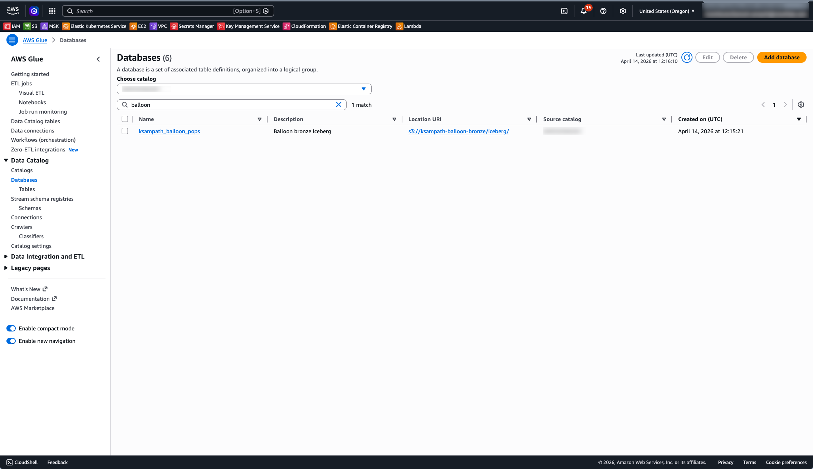

# Bronze landing zone (prerequisite)

This document is the **detailed** prerequisite for the Snowflake lab: **Iceberg bronze on S3** and a **REST catalog** Snowflake can use before **`CREATE DATABASE … LINKED_CATALOG`**.

**Phase 0 — environment:** copy [`.env.example`](../.env.example) to `.env`, fill in **AWS** and **bronze** variables (never commit `.env`). Set **`AWS_PROFILE`** (and usually **`AWS_REGION`**) to a profile with a **valid AWS session** (SSO or access keys). Run **`task check-tools`** from the repo root: it confirms required CLIs (**aws**, **snow**, **task**, **envsubst**, **jq**, **cortex**, **uv**) and recommended tools (**direnv**, **curl**, **openssl**) on your `PATH`, then runs **`aws sts get-caller-identity`** so you catch **expired or missing credentials** before **`task bronze:*`** (see [README](../README.md)). Install **[direnv](https://direnv.net/)** and allow the repo (e.g. `direnv allow`) so `.envrc` loads `.env` automatically. Extend `.env.example` as new phases add Snowflake CLI, PAT, or DuckDB IRC variables.

**Shared AWS account / workshop:** set **`LAB_USERNAME`** (one id per participant) so **`GLUE_DATABASE`** defaults when unset, and **`BRONZE_BUCKET_NAME`** / **`BRONZE_S3TABLES_BUCKET_NAME`** get a per-participant prefix (see [`.env.example`](../.env.example)). **`S3TABLES_NAMESPACE`** stays `balloon_pops` inside each participant’s table bucket unless you change it deliberately.

### Environment variables reference

| Variable | Used by | Purpose |
|----------|---------|---------|
| `AWS_PROFILE` | all `task bronze:*` commands | Choose AWS credentials/profile for real account operations |
| `AWS_REGION` | all `task bronze:*` commands | Ensure Glue/S3/S3 Tables calls target the correct region |
| `LAB_USERNAME` | derivation in `bronze_cli.py` | Derives **`GLUE_DATABASE`** when unset; prefixes **`BRONZE_BUCKET_NAME`** and **`BRONZE_S3TABLES_BUCKET_NAME`** unless already **`<bucket_slug>-…`** |
| `BRONZE_BUCKET_NAME` | `bronze:glue-setup`, `bronze:load`, `bronze:render-iam` | General-purpose S3 bucket (must exist). With **`LAB_USERNAME`**, defaults to **`<bucket_slug>-balloon-bronze`** or **`<bucket_slug>-<your-suffix>`** if you set a short name; warehouse URI is `s3://<bucket>/iceberg/` (printed after `glue-setup`, `.aws-config/bronze-warehouse-uri.txt`). **`render-iam`** derives **`arn:aws:s3:::<bucket>`** for the policy (no separate ARN env var). |
| `GLUE_DATABASE` (optional) | `bronze:glue-setup`, `bronze:load` | Override derived/default Glue database name |
| `BRONZE_S3TABLES_BUCKET_NAME` | `bronze:s3tables-setup` | S3 Tables bucket; same **`<bucket_slug>-balloon-*`** pattern as **`BRONZE_BUCKET_NAME`** (empty + **`LAB_USERNAME`** → **`<bucket_slug>-balloon-s3tables`**) |
| `BRONZE_S3TABLES_BUCKET_ENABLE_SUFFIX` (optional) | **`s3tables-setup` only** | Truthy values append **`-<epoch_millis>`** once when **`s3tables-setup`** runs (suffix is **not** applied on every name derivation). **`s3tables-setup`** writes **`.aws-config/s3tables-table-bucket-arn.txt`** and **`.aws-config/bronze-s3tables-last-bucket-name.txt`**; Snowflake tooling resolves the table-bucket from those files (see [`.aws-config/README.md`](../.aws-config/README.md)). **`bronze:cleanup`** reads **`.aws-config/`** by default, then removes bronze-authored files after successful teardown; use **`uv run bronze-cli cleanup --no-aws-config`** if you must ignore on-disk hints. |
| `S3TABLES_NAMESPACE` (optional) | `bronze:s3tables-setup`, `bronze:cleanup` | Namespace to create/manage/delete inside S3 Tables bucket |

**Manual QA:** follow [bronze-landing-zone-MANUAL-TEST.md](bronze-landing-zone-MANUAL-TEST.md). After bronze, **Snowflake CLD** QA: [snowflake-cld-MANUAL-TEST.md](snowflake-cld-MANUAL-TEST.md).

The Quickstart **Setup** section should summarize steps here and link to this file. **Do not** make “load bronze” the first main Snowflake chapter—learners start Snowflake hands-on at **CLD** ([snowflake-catalog-cld.md](snowflake-catalog-cld.md)).

## What gets created in AWS Glue

When you use the **Glue / S3 Tables** path, the workshop should create (or register) an Iceberg **Glue database** and a single raw-events **table** **`balloon_game_events`**. Each row stores one **JSON object** in string column **`event`** (Kafka-style **PLAIN JSON** payload: `player`, `balloon_color`, `score`, `page_id`, `favorite_color_bonus`, `event_ts`). **Snowflake Dynamic Iceberg Tables** use JSON extraction (for example **`PARSE_JSON`**) over **`event`**; stream field definitions and DT patterns are in [snowflake/lab/REFERENCE.md](../snowflake/lab/REFERENCE.md).

| Glue database (example) | Raw Iceberg table | Columns (logical) |
|-------------------------|-------------------|---------------------|
| `balloon_pops` | `balloon_game_events` | `event` (VARCHAR/STRING JSON per row) |

Replace `balloon_pops` with your **Glue catalog / S3 Tables namespace** if it differs. Match **`CATALOG_NAME`** in Snowflake `CREATE CATALOG INTEGRATION` so **`LINKED_CATALOG`** sees the same objects. Optional extra Iceberg layout notes: [docs/iceberg_schema_design.md](../docs/iceberg_schema_design.md).

**Polaris-only path:** publish an analogous list (REST **namespace** + **table** identifiers) in Prerequisites instead of Glue.

## Automation (`task bronze:…`)

Modular tasks live in [`.taskfiles/bronze.yml`](../.taskfiles/bronze.yml) (included from the root `Taskfile.yml`). Implementation is **Python + Click** ([`tools/bronze_preload/bronze_cli.py`](../tools/bronze_preload/bronze_cli.py)) so the same commands work on **Windows, Linux, and macOS** (still requires **AWS CLI** on `PATH` for `s3tables` and for `sts` in `render-iam`). Use a **real** AWS account: set **`AWS_PROFILE`** (and usually **`AWS_REGION`**). See [tools/bronze_preload/README.md](../tools/bronze_preload/README.md) for full env vars.

| Task | Purpose |
|------|---------|
| `task bronze:render-iam` | Render `lab/aws/bronze-glue-writer-policy.json` → `.aws-config/*.rendered.json` (policy **`BRONZE_S3_ARN`** is derived from **`BRONZE_BUCKET_NAME`**) |
| `task bronze:render-iam-dry-run` | Print substituted policy JSON only (no file write) |
| `task bronze:glue-setup` | Create Glue database for **`GLUE_DATABASE`** with `LocationUri` **`s3://<BRONZE_BUCKET_NAME>/iceberg/`** |
| `task bronze:glue-setup-dry-run` | Preview Glue setup (read-only **GetDatabase**; no create / no local JSON) |
| `task bronze:s3tables-setup` | **`aws s3tables`** — table bucket **`BRONZE_S3TABLES_BUCKET_NAME`**, namespace **`balloon_pops`**, one **`ICEBERG`** table **`balloon_game_events`** (CLI **2.34+**) |
| `task bronze:s3tables-setup-dry-run` | Preview S3 Tables setup (read-only list; no creates) |
| `task bronze:snowflake-summary` | Read-only: print exports, ARNs, Glue Iceberg REST URI, and table names for Snowflake catalog / CLD prep (optional `task bronze:snowflake-summary-json` for JSON) |
| `task bronze:lakeformation-setup` | After **`bronze:load`** and **`snowflake:create-glue-catalog-read-role`** (LF grants need the **SIGV4** ARN): LF data-access IAM role, **`register-resource`**, Glue **`CreateTableDefaultPermissions`**, LF grants to **`SIGV4`** (dry-run: **`task bronze:lakeformation-setup-dry-run`**) |
| `task bronze:load` | **`load_sample.py`** — default **generator** replay (**`BRONZE_LOAD_DURATION_MINUTES`** / **`DELAY`**) appends each **`GameEvent`** as one row in **`balloon_game_events`**; **`--row-count`** / **`BRONZE_SAMPLE_ROW_COUNT`** for synthetic mode |
| `task bronze:load-more` | Append a second prebuilt dataset into the same Glue Iceberg tables (optional) |
| `task bronze:cleanup-dry-run` | Preview bronze cleanup plan (no deletes) |
| `task bronze:cleanup` | Delete Glue tables/database + S3 Tables namespace/table-bucket metadata (asks confirmation unless `--yes`). Overlays **`GLUE_DATABASE`**, **`BRONZE_BUCKET_NAME`**, **`BRONZE_S3TABLES_BUCKET_NAME`** from repo **`.aws-config/`** when present (last local **`glue-setup`** / **`s3tables-setup`**). After successful deletes, removes bronze-authored **`.aws-config/`** artifacts (Glue + S3 Tables); keeps **`snowflake-glue-catalog-*`** files. **Does not** delete or empty **`BRONZE_BUCKET_NAME`** in S3; clear **`iceberg/`** yourself if you want warehouse data removed |
| `task bronze:all` | Runs `glue-setup` → `s3tables-setup` → `load` in strict sequence |

### Glue + S3 warehouse vs S3 Tables (two surfaces)

- **Glue Data Catalog + S3** — `glue-setup` and **`bronze:load`** populate **Iceberg** metadata + files for **`balloon_game_events`** (workshop-friendly raw stream).
- **Amazon S3 Tables** — `s3tables-setup` creates the **table bucket / namespace / ICEBERG** shell for **`balloon_game_events`** for Snowflake **Glue Iceberg REST** alignment; it is **not** auto-filled by `load_sample.py` (add a Glue-REST writer later if you want one copy only).

### Athena (and other SQL clients)

**`task bronze:load`** registers **Iceberg** tables only in the **AWS Glue Data Catalog** under **`GLUE_DATABASE`**, with data under **`s3://<BRONZE_BUCKET_NAME>/iceberg/`** (PyIceberg `glue` catalog — see [`load_sample.py`](../tools/bronze_preload/load_sample.py)). The loaded table exposes column **`event`** (string holding one JSON object per row); use Athena JSON functions to project fields. In [Amazon Athena](https://docs.aws.amazon.com/athena/latest/ug/querying-iceberg.html):

1. **Data source:** **`AwsDataCatalog`** (typical).
2. **Catalog:** use the **default** Glue catalog for the account. In the Athena UI this is often **None** / blank / “default” — do **not** pick **`s3tables/<table-bucket>`** from the dropdown; that path is the **S3 Tables** federated catalog (empty Iceberg shells for this lab until another writer commits metadata). If your console shows **`AwsDataCatalog`** / **`awsdatacatalog`** instead of None, that is the same idea: avoid any catalog whose name starts with **`s3tables/`**.
3. **Database:** the **Glue** database from bronze (see **`GLUE_DATABASE`** in `.env` or **`Name`** in `.aws-config/glue-database.json`). With **`LAB_USERNAME`** set and **`GLUE_DATABASE`** unset, it is usually **`<glue_slug>_balloon_pops`** (for example **`ksampath_balloon_pops`**), **not** the string **`balloon_pops`** alone (that name is often the **S3 Tables namespace**, a different object).

If you query through an **S3 Tables** catalog (SQL or UI paths like **`s3tablescatalog/<table-bucket>`** or **`s3tables/…`** in the catalog dropdown), the lab’s S3 Tables **`balloon_game_events`** registration is an **empty shell** until some engine writes Iceberg metadata into that table bucket. Athena then fails with errors such as **missing `metadata_location`**. For the seed dataset from this repo, use the **default Glue** catalog + **`GLUE_DATABASE`**, or **re-load** using a writer that targets S3 Tables.

Keep **secrets** out of Task YAML; use **`.aws-config/`** for generated policy JSON (see [.aws-config/README.md](../.aws-config/README.md)).

### Local config directory (`.aws-config/`)

Use a repo-local **`.aws-config/`** directory (not `~/.aws`) for **generated** IAM JSON, trust-policy fragments, or other outputs from the bronze CLI—filled at **run time** from **environment variables** and **`AWS_PROFILE`**. The tree is **gitignored** except [`.aws-config/README.md`](../.aws-config/README.md) and optional `*.example` files. **Committed** policy **templates** with placeholders should live under **`lab/aws/`** (added when bronze tasks are implemented).

After **`glue-setup`** / **`s3tables-setup`**, prefer on-disk **`glue-database.json`** and S3 Tables ARN / last-bucket files for anything that must match AWS ( **`snowflake-lab-sql generate`**, **`task snowflake:create-glue-catalog-read-role`**, **`bronze-cli snowflake-summary`** ) — those commands **error** if **`glue-database.json`** is missing, and (in S3 Tables catalog mode) if the table-bucket cannot be resolved. **`.env`** is for bootstrap and intentional overrides only.

## Recommended order

1. Pick **region** (AWS, S3, Snowflake aligned).
2. **S3 warehouse bucket** — create a general-purpose S3 bucket (console, IaC, or your org’s process). Set **`BRONZE_BUCKET_NAME`** (or use **`LAB_USERNAME`** defaults). **`render-iam`** derives **`arn:aws:s3:::<bucket>`** for the policy template.
3. **IAM** for writers (PyIceberg / Glue role) and bucket policy for Snowflake **storage integration** / **external volume** where your Snowflake lab needs them; use **`task bronze:render-iam`** for the lab’s Glue-writer policy template when applicable.
4. **Glue** path: run `task bronze:glue-setup` then `task bronze:s3tables-setup` (or your CFN equivalent).
5. **REST catalog**: either **Polaris** (reachable from Snowflake, not only `localhost`) or **Glue Iceberg REST** (`https://glue.<region>.amazonaws.com/iceberg`, `CATALOG_API_TYPE = AWS_GLUE`, SIGv4 — see [gist](https://gist.github.com/kameshsampath/e9c8c27097dd23378d70f63c9e978426) and Snowflake docs).
6. **Load**: `task bronze:load` (or `task bronze:all` from a clean slate).
7. **Verify**: see [Verify bronze load in the AWS Console](#verify-bronze-load-in-the-aws-console) (Glue + S3 warehouse) and [Verify S3 Tables in the AWS Console](#verify-s3-tables-in-the-aws-console) (table buckets after **`s3tables-setup`**); CLI checks remain in [bronze-landing-zone-MANUAL-TEST.md](bronze-landing-zone-MANUAL-TEST.md). Optional: Snowflake `DESCRIBE CATALOG INTEGRATION` smoke when that phase exists.
8. **Snowflake SIGV4 catalog role (IAM, same AWS account):** run **`task snowflake:create-glue-catalog-read-role`** (writes **`.aws-config/snowflake-glue-catalog-iam-role-arn.txt`**) **after** **`glue-setup`** (needs **`glue-database.json`**) and **before** **`task bronze:lakeformation-setup`**, because LF **`grant-permissions`** targets that ARN. The role does **not** require loaded S3 data; the usual lab order is steps **6–7** (load + verify) then **this step** then step **9**, matching [snowflake-catalog-cld.md](snowflake-catalog-cld.md) Option A. Dry-run: **`task snowflake:create-glue-catalog-read-role-dry-run`**.
9. **Lake Formation (Snowflake Glue REST + vended credentials)**: **after** step 8, use **two different IAM roles**—the Snowflake **`SIGV4_IAM_ROLE`** from step 8 and a **Lake Formation data-access role** (S3 reads on behalf of LF)—then run **`task bronze:lakeformation-setup-dry-run`** and **`task bronze:lakeformation-setup`** (or the manual CLI in [Lake Formation (after bronze load)](#lake-formation-after-bronze-load)). LF **`grant-permissions`** must target the **existing** SIGV4 role ARN, so the signer task **precedes** this step. Do this **before** or **in lockstep with** Snowflake **`CREATE CATALOG INTEGRATION`** if you use **`ACCESS_DELEGATION_MODE = VENDED_CREDENTIALS`** ([Snowflake: Glue Iceberg REST + Lake Formation](https://docs.snowflake.com/en/user-guide/tables-iceberg-configure-catalog-integration-rest-glue)).
10. **Cleanup (optional end-of-lab)**: `task bronze:cleanup-dry-run` then `task bronze:cleanup` when you want to remove **Glue and S3 Tables metadata** only. Your **general-purpose warehouse bucket** (**`BRONZE_BUCKET_NAME`**, often **`<slug>-balloon-bronze`**) is **not** deleted or emptied; delete **`s3://…/iceberg/`** objects in the console or with **`aws s3 rm`** if you need a full data reset. Lake Formation registrations and IAM roles you created for LF are **not** removed by **`bronze:cleanup`**; delete those in AWS if you need a full reset.

## Verify bronze load in the AWS Console

After **`task bronze:load`** (or **`task bronze:all`**), confirm rows landed where Glue and PyIceberg expect: **AWS Glue Data Catalog** (table metadata) and **Amazon S3** (Iceberg warehouse layout under `iceberg/`). Use the same **Region** and account as **`AWS_PROFILE`**.

AWS occasionally renames console areas; if labels differ, use the service search bar for **Glue** and **S3** and open **Data catalog** / **Databases** for Glue.

### AWS Glue Data Catalog

1. Open the [AWS Management Console](https://console.aws.amazon.com/) with permissions to read Glue.
2. Go to **Glue** → **Data catalog** → **Databases** (or **Catalog** → **Databases**, depending on console layout).
3. Open the database whose name matches **`GLUE_DATABASE`** (see [What gets created in AWS Glue](#what-gets-created-in-aws-glue); default **`balloon_pops`** or derived when **`LAB_USERNAME`** is set).
4. Open **Tables** for that database. You should see **`balloon_game_events`** (raw event stream for CLD + Dynamic Iceberg Tables in Snowflake).
5. Open **`balloon_game_events`**. Confirm the table type / format indicates **Apache Iceberg** and that storage references stay under **`s3://<BRONZE_BUCKET_NAME>/iceberg/`**.




### Amazon S3 (warehouse bucket)

1. Open **S3** → **Buckets** → the bucket named **`BRONZE_BUCKET_NAME`**.
2. Open the **`iceberg/`** prefix (this matches Glue **LocationUri** `s3://<BRONZE_BUCKET_NAME>/iceberg/` from **`glue-setup`**).
3. After load, expect Iceberg-style **`metadata/`** and **`data/`** (or equivalent) keys under that prefix.

**Optional figure:** when you have a clear capture, add **`images/bronze-s3-bucket.png`** (S3 → **Buckets** → row for **`BRONZE_BUCKET_NAME`**) and embed it here; filenames are listed in [lab/images/README.md](images/README.md).

**Optional screenshot** (`images/bronze-s3-iceberg-prefix.png`): after you open the **`iceberg/`** prefix in the console, capture **`metadata/`** and **`data/`** (or equivalent) so learners see proof of Iceberg files on S3. Omit the file until you have a clear shot; the CLI check `aws s3 ls s3://$BRONZE_BUCKET_NAME/iceberg/` remains enough to validate.

## Lake Formation (after bronze load)

Use this when Snowflake reads the Glue-backed bronze table through **Glue Iceberg REST** with **vended credentials** ( **`ACCESS_DELEGATION_MODE = VENDED_CREDENTIALS`** in **`CREATE CATALOG INTEGRATION`** ). Lake Formation then mediates **S3** access for table data: you register the warehouse bucket (or prefix) with LF, and you grant your **Snowflake catalog `SIGV4` IAM role** LF permissions on the Glue database and tables. That is separate from the **PyIceberg writer** IAM policy under **`lab/aws/bronze-glue-writer-policy.json`**.

**Automation:** from the repo root, after **`task snowflake:create-glue-catalog-read-role`** and **`task bronze:load`**, run **`task bronze:lakeformation-setup-dry-run`** then **`task bronze:lakeformation-setup`** (same env as **`glue-setup`**). The subsections below are the manual equivalent and explain each step.

**Concepts:** [Lake Formation](https://docs.aws.amazon.com/lake-formation/latest/dg/what-is-lake-formation.html) · Snowflake [Configure a catalog integration for AWS Glue Iceberg REST](https://docs.snowflake.com/en/user-guide/tables-iceberg-configure-catalog-integration-rest-glue) (Lake Formation subsection) · AWS [underlying data access control](https://docs.aws.amazon.com/lake-formation/latest/dg/access-control-underlying-data.html).

### Why these AWS Lake Formation settings

With **vended credentials**, Snowflake’s assumed **`SIGV4_IAM_ROLE`** talks to the **Glue Iceberg REST** catalog and asks Lake Formation to **issue short-lived credentials** for the Iceberg table’s **underlying S3 objects**. Lake Formation must therefore know three things: **(1)** which **S3 location** holds that data, **(2)** which **IAM role** Lake Formation may assume to read that location from S3, and **(3)** which **Lake Formation data permissions** apply to the **SIGV4** principal on the Glue database and tables. Without that chain, Glue cannot safely vend credentials that match your governance rules.

| Step | Why it matters |
|------|----------------|
| **LF data-access IAM role** (trusted by **`lakeformation.amazonaws.com`**, S3 read on the warehouse bucket) | When LF vends access to S3, it assumes this role to read **`BRONZE_BUCKET_NAME`**. It is **not** the same job as the Snowflake **`SIGV4_IAM_ROLE`** (which is trusted by **Snowflake** and calls Glue/LF APIs). |
| **`register-resource`** (**`HybridAccessEnabled=false`**, **`WithFederation=false`**) | Register the warehouse S3 location under **Lake Formation** data access control only—not [hybrid access mode](https://docs.aws.amazon.com/lake-formation/latest/dg/hybrid-access-mode.html) (`HybridAccessEnabled=true`), which also allows IAM/S3-policy paths alongside LF and has been a common source of **Snowflake credential vending** confusion. Do **not** set **`WithFederation`** for this Glue-backed warehouse path ([`RegisterResource`](https://docs.aws.amazon.com/lake-formation/latest/APIReference/API_RegisterResource.html): federation marks a **federated** Data Catalog resource). |
| **`glue update-database`** with empty **`CreateTableDefaultPermissions`** | New Glue tables often get default permissions that effectively use **IAM access control only**; that can **block** Lake Formation from applying LF permissions. Clearing defaults lets **LF permissions** (and your grants to the SIGV4 role) take effect—i.e. new tables follow **Lake Formation** permission mode for underlying data, not IAM-only defaults. |
| **`lakeformation grant-permissions`** to the **SIGV4** role | LF must explicitly allow the **same** IAM principal Snowflake uses for **`SIGV4_IAM_ROLE`** to **describe** the database and **select/describe** tables so vended reads are authorized. |

**Do not reuse one IAM role for both jobs.** The **`SIGV4_IAM_ROLE`** (Snowflake catalog signer: Glue read + Lake Formation **API** calls such as **`GetDataAccess`**) and the **Lake Formation data-access role** passed to **`register-resource --role-arn`** (S3 **object** reads on behalf of LF) **must be different roles**. Using a **single** role for both often leads to **credential vending errors** (conflicting trust: Snowflake must assume the SIGV4 role; Lake Formation must assume the data-access role for S3, and those trust policies and session paths are not interchangeable).

**Avoid hybrid + federation on the warehouse registration.** For Snowflake **Glue Iceberg REST** with **`VENDED_CREDENTIALS`**, keep **`register-resource`** on **`BRONZE_BUCKET_NAME`** at **`HybridAccessEnabled=false`** (CLI: **`--no-hybrid-access-enabled`**) and **`WithFederation=false`** (CLI: **`--no-with-federation`**). Enabling hybrid or federation here is unnecessary for this lab and can interfere with predictable LF-only vending.

### 1. IAM role trusted by Lake Formation (S3 read on the bronze bucket)

Create a **dedicated** IAM role (not the Snowflake **`SIGV4_IAM_ROLE`**) whose **trust policy** allows **`lakeformation.amazonaws.com`** to **`sts:AssumeRole`**, and whose **permissions policy** allows **`s3:GetObject`**, **`s3:GetObjectVersion`**, and **`s3:ListBucket`** on **`arn:aws:s3:::<BRONZE_BUCKET_NAME>`** and **`arn:aws:s3:::<BRONZE_BUCKET_NAME>/*`**. This role is the **data access** principal LF uses for that S3 location (example name pattern: **`<lab-slug>-lf-data-access`**). You can start from the JSON under **`lab/aws/`** when those templates are present, or paste equivalent JSON in the IAM console.

### 2. Register the S3 location (Lake Formation only; no hybrid, no federation)

**Why:** Tells Lake Formation which role it may use to read objects under this bucket when it fulfills vended-access requests for LF-authorized principals. Use **Lake Formation** permission behavior for that location ([`HybridAccessEnabled`](https://docs.aws.amazon.com/lake-formation/latest/APIReference/API_RegisterResource.html) **false** — not both LF and S3/IAM “hybrid” paths). Do **not** pass **`WithFederation`**: that flag is for **federated** Data Catalog resources, not this standard Glue + S3 warehouse registration.

Replace placeholders with your account, region, bucket, and the **LF data-access** role ARN from step 1 (not the SIGV4 role):

```bash
aws lakeformation register-resource \
  --resource-arn "arn:aws:s3:::<BRONZE_BUCKET_NAME>" \
  --role-arn "arn:aws:iam::<AWS_ACCOUNT_ID>:role/<LF_DATA_ACCESS_ROLE_NAME>" \
  --no-hybrid-access-enabled \
  --no-with-federation \
  --region <AWS_REGION>
```

### 3. Glue database: Lake Formation mode for new tables (clear IAM-only defaults)

**Why:** Otherwise new tables can inherit **IAM-only** defaults and **Lake Formation never gets a chance** to enforce LF grants for those tables—vended reads then fail or behave inconsistently. Clearing defaults aligns the database with **Lake Formation**-governed access for underlying data rather than **IAM-only** table defaults.

Do **not** point this lab’s **`GLUE_DATABASE`** at a **Glue federated** / external federation catalog for the Snowflake vended-credentials path unless you are following a separate, documented architecture.

So Lake Formation can govern table access, clear **`CreateTableDefaultPermissions`** on your **`GLUE_DATABASE`** (keep **`Name`** and **`LocationUri`** as returned by Glue):

```bash
aws glue update-database \
  --name "<GLUE_DATABASE>" \
  --database-input '{"Name":"<GLUE_DATABASE>","CreateTableDefaultPermissions":[]}' \
  --region <AWS_REGION>
```

If your org already sets **`LocationUri`** / **`Parameters`** in Glue, merge those fields from **`aws glue get-database`** into **`--database-input`** instead of overwriting with a minimal JSON object.

### 4. Grant the Snowflake catalog IAM role via Lake Formation

**Why:** LF authorizes **which** IAM principal may see catalog metadata and read table data through LF. That principal must be the **Snowflake catalog** role (**`SIGV4_IAM_ROLE`**), **not** the LF S3 data-access role from step 1.

The principal is the **Snowflake SIGV4 catalog role ARN** you set as **`SIGV4_IAM_ROLE`** (create it first with **`task snowflake:create-glue-catalog-read-role`** if you use the repo helper, then read **`.aws-config/snowflake-glue-catalog-iam-role-arn.txt`**). Replace **`<SIGV4_ROLE_ARN>`** and **`<GLUE_DATABASE>`** below:

```bash
aws lakeformation grant-permissions \
  --principal "DataLakePrincipalIdentifier=<SIGV4_ROLE_ARN>" \
  --resource '{"Database":{"Name":"<GLUE_DATABASE>"}}' \
  --permissions "DESCRIBE" \
  --region <AWS_REGION>

aws lakeformation grant-permissions \
  --principal "DataLakePrincipalIdentifier=<SIGV4_ROLE_ARN>" \
  --resource '{"Table":{"DatabaseName":"<GLUE_DATABASE>","TableWildcard":{}}}' \
  --permissions "SELECT" "DESCRIBE" \
  --region <AWS_REGION>
```

### 5. Optional — grant an admin IAM principal (avoid LF lockout)

In shared accounts, grant an operator or SSO role **`ALL`** on the same database and table wildcard so you can recover if the LF data-access role is mis-deleted. Use your org’s IAM principal ARN (example shape: **`arn:aws:iam::<AWS_ACCOUNT_ID>:role/aws-reserved/sso.amazonaws.com/...`**).

### 6. Snowflake **`SIGV4_IAM_ROLE`** inline policy (Glue + Lake Formation)

**Why:** Snowflake assumes this role to **call Glue REST** and **Lake Formation APIs** that request vended credentials. **S3 object access** for the table files is still performed under the **LF data-access role** from step 1 when LF vends access—so keep **SIGV4** and that **data-access** role **separate** to avoid vending and trust-policy confusion.

For the **Snowflake catalog** role, the lab targets an inline policy that allows **Glue** read APIs on **`GLUE_DATABASE`** (including **`catalog`** and **`catalog/*`** ARNs where appropriate) and **Lake Formation** **`GetDataAccess`**, **`GetTemporaryGlueTableCredentials`**, and **`GetTemporaryGluePartitionCredentials`** on **`"Resource":"*"`** as required for credential vending—without attaching **S3** statements to that same role when S3 is fully delegated through Lake Formation. The rendered template is **`lab/aws/snowflake-glue-catalog-read-policy.json`** (see [snowflake-catalog-cld.md](snowflake-catalog-cld.md) Option A). If you use the **S3 Tables federated catalog** shape (**`s3tablescatalog/...`** in **`CATALOG_NAME`**), extend IAM separately; that path is not the default in this repo’s generated SQL.

Continue with [snowflake-catalog-cld.md](snowflake-catalog-cld.md) for **`CREATE CATALOG INTEGRATION`**, trust render/apply, and CLD SQL.

## Verify S3 Tables in the AWS Console

After **`task bronze:s3tables-setup`**, confirm the **Amazon S3 Tables** control plane shows your **table bucket** (name = **`BRONZE_S3TABLES_BUCKET_NAME`**). Console labels vary; use the top search bar for **S3 Tables** if needed. [S3 Tables](https://docs.aws.amazon.com/AmazonS3/latest/userguide/s3-tables.html) stores a separate Iceberg surface from the **Glue + general S3** warehouse: default **`bronze:load`** writes to **`BRONZE_BUCKET_NAME`** / **`iceberg/`** (previous section), while S3 Tables holds the **`balloon_game_events`** **ICEBERG** table definition for Snowflake **Glue Iceberg REST** alignment until another engine commits there.

1. Open **Amazon S3 Tables** → **Table buckets** (or equivalent list view for table buckets in your region).
2. Find the row whose name matches **`BRONZE_S3TABLES_BUCKET_NAME`** (same value as in `.env` or from **`task bronze:snowflake-summary`**).
3. Optional: open that table bucket and confirm namespaces / tables align with **`S3TABLES_NAMESPACE`** (default **`balloon_pops`**) and **`balloon_game_events`**.

**Optional figure:** when you have a clear capture, add **`images/bronze-s3tables-list.png`** (**S3 Tables** → **Table buckets** including **`BRONZE_S3TABLES_BUCKET_NAME`**) and embed it here; see [lab/images/README.md](images/README.md).

**Screenshot file list** (filenames and what each should show): [lab/images/README.md](images/README.md). For the Snowflake Quickstart build, copy the same PNGs into **`sfguides/lakehouse-iceberg-production-pipelines/assets/`** (see [assets/README.md](../sfguides/lakehouse-iceberg-production-pipelines/assets/README.md)).

## Snowflake handoff

Record (outside git): catalog integration **URI**, **OAuth / SIGv4 role ARNs**, **external IDs**, **storage integration** names. Bronze **data paths** must stay consistent with **Dynamic Iceberg Table** **external volume** prefixes documented in the main lab.

After **`CREATE CATALOG INTEGRATION`** for Glue Iceberg REST, generate the IAM **trust** JSON for your **`SIGV4_IAM_ROLE`** with **`task snowflake:render-glue-catalog-trust`** (see [snowflake/lab/README.md](../snowflake/lab/README.md))—same **`snow sql` + rendered template** idea as **sfutils-extvolumes** for external volumes.

## References

- [Iceberg schema (this repo)](../docs/iceberg_schema_design.md)
- [Snowflake: Iceberg REST catalog integration](https://docs.snowflake.com/en/user-guide/tables-iceberg-configure-catalog-integration-rest)
- [Glue + Snowflake IAM / SQL gist](https://gist.github.com/kameshsampath/e9c8c27097dd23378d70f63c9e978426)
- [Lakehouse walkthrough (video)](https://youtu.be/DObaF-Fk1_A)
