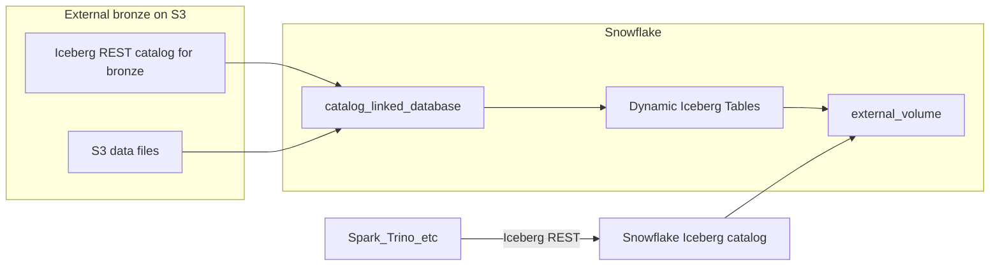

**Tracked in repo**: [`plans/snowflake_stack_refactor_97a1b8ee.plan.md`](plans/snowflake_stack_refactor_97a1b8ee.plan.md) — treat this path as the **version-controlled** source of truth; sync or replace any copy under `~/.cursor/plans/` when you open the plan in Cursor.

# Snowflake Stack lab refactor (CLD bronze on S3)

**Lab narrative (updated)**: **Bronze on S3 via Polaris + PyIceberg is prerequisite work**—completed during **Prerequisites / Setup** (Docker Polaris, reachable URL, `task bronze:preload`, verify tables in catalog). The **instructional Snowflake track starts at catalog linking**, i.e. learners’ **first main hands-on content after Setup is CLD** (catalog integration → catalog-linked database → then transforms / DTs / SiS—not “how to load bronze” as chapter 1).

**Your five-step summary (covered in this plan)**

1. **Load bronze** — **`phase-bronze-landing-zone`** + [`lab/bronze-landing-zone.md`](lab/bronze-landing-zone.md) (S3, IAM, Polaris; **PyIceberg** default, **AWS Glue** optional if CLD path validated); **Prerequisites / Setup** in the sfguide—not Snowflake chapter 1.
2. **CLD** — **`snowflake-sql-lab`** + SFGuide Phase 3: **catalog integration (REST)** → **catalog-linked database**; first main Snowflake hands-on.
3. **DT** — **Dynamic Iceberg Tables** (silver/gold) on Snowflake-managed Iceberg + **external volume**; `snowflake/lab/*.sql` + Snowflake Notebooks.
4. **SiS** — **Streamlit in Snowflake**; `snowflake/streamlit/` or SQL deploy; primary viz.
5. **External tool (DuckDB)** — **DuckDB + Horizon IRC** appendix: **read** DT Iceberg externally (after DTs exist); [hirc-duckdb-demo](https://github.com/kameshsampath/hirc-duckdb-demo) pattern; optional `task duckdb:…`.

**Also in plan but not in your five bullets**: PAT (**sfutils-pat**), external volume tooling (**sfutils-extvolumes**), modular **Taskfile**, **Snowflake Notebooks** (sync with SQL), optional **local Streamlit**, **pyproject** deps, **companion-repo-delete**, four **sfguide authoring** phases + **Conclusion**.

## Lab identity, naming, and repo move

- **Public lab title** (sfguide H1 / marketing): **Lakehouse Transformations: Build Production Pipelines for your Iceberg Tables** (action-verb phrasing per create-sfguide can shorten for H1 if needed; align summary and README with this theme).
- **`id` slug** (YAML + folder): pick a hyphenated slug derived from the lab (e.g. `lakehouse-iceberg-production-pipelines`—finalize in SFGuide Phase 1).
- **Rename in-repo branding**: update **README**, root **pyproject** `project.name` / descriptions, and any user-facing strings so they match this lab name and Iceberg pipeline story (balloon game remains the **sample domain data**, not the product name).
- **GitHub**: when all todos are done, **move this branch to a new repository** (fresh remote / subtree split per your preference); document old `balloon-popper-demo` link once in README or Related Resources if you want continuity for prior readers.

## Phased delivery (merged with sfguide workflow)

**Program rule**: Do **not** implement the whole refactor in one agent run. Prefer **one todo (or one sfguide sub-phase) at a time**, validate, **commit**, then proceed.

**Critical ordering**:

1. **SFGuide Phase 1** (extraction map from current [`docs/`](docs/) and [`polaris-forge-setup/templates/`](polaris-forge-setup/templates/) / schema notes) and **schema lift** into `snowflake/lab/` or `sfguides/` notes **must complete and be committed** first.
2. **`phase-bronze-landing-zone`** (exclusive S3 / IAM / Polaris / preload doc + code + **test + commit**)—**before** **`companion-repo-delete`** so templates remain available until snippets are copied into `tools/bronze-preload/` / `lab/`.
3. **`companion-repo-delete`** then removes obsolete trees.

**SFGuide sub-phases** (same spirit as [phased_sf_quickstart_4fb30bd5.plan.md](phased_sf_quickstart_4fb30bd5.plan.md), content retargeted to this Snowflake lab):

- **SFGuide Phase 1**: Author name, final `id`, extraction map (source section → sfguide section); gate: you review map, then commit.
- **SFGuide Phase 2**: `sfguides/<id>/<id>.md` with YAML frontmatter, **Overview** (What You'll Learn / Build / Prerequisites), **Setup** (summarize prereq; **link or inline short** pointer to **[`lab/bronze-landing-zone.md`](lab/bronze-landing-zone.md)** for **S3 bucket, IAM role, IAM policy, bucket policy, Polaris URL, preload tasks**—full detail stays in that exclusive doc); **`snow` CLI**; **do not** make bronze the first *main* H2 after Setup—**first main Snowflake chapter = CLD** (Phase 3). Partial create-sfguide checklist; commit.
- **SFGuide Phase 3**: **Main content opens with CLD** (catalog integration → catalog-linked database), then **Dynamic Iceberg Tables**, **SiS**, and **DuckDB + Horizon IRC** appendix for **reading DT Iceberg externally**. Keep code/SQL aligned with `snowflake/lab/*.sql`; commit.
- **SFGuide Phase 4**: **Conclusion And Resources** + full validation checklist; commit.

Between sub-phases, **pause** after your commit; do not ask the agent for “Phases 2–4 in one go.”

## Program phase: Bronze landing zone

**Exclusive scope; own test + commit.** This is a **separate program phase** from the four **sfguide authoring** sub-phases. **Implement, validate, and commit** this phase **on its own** before starting **`companion-repo-delete`** (recommended: keep `polaris-forge-setup` templates available until snippets are copied into `tools/bronze-preload/` / `lab/`).

### Deliverables (single phase, one commit or tight commit series)

- **Exclusive documentation**: add **[`lab/bronze-landing-zone.md`](lab/bronze-landing-zone.md)** (or `sfguides/bronze-landing-zone.md` if you prefer it next to the main guide) covering **Iceberg bronze on S3** and how **Snowflake CLD** binds—**either** (A) **Apache Polaris (REST)** + PyIceberg/Glue writers **or** (B) **AWS Glue Iceberg REST** catalog integration (**`CATALOG_SOURCE = ICEBERG_REST`**, `CATALOG_API_TYPE = AWS_GLUE`, `CATALOG_URI` = `https://glue.<region>.amazonaws.com/iceberg`, vended SIGV4 auth per [gist](https://gist.github.com/kameshsampath/e9c8c27097dd23378d70f63c9e978426) / docs) then **`CREATE DATABASE … LINKED_CATALOG = ( CATALOG = '<integration_name>' )`**—same “CLD after bronze” lab shape, different catalog backend.
- **Implementation**: `tools/bronze-preload/` (**PyIceberg**, default), **Docker Compose** (or runbook) for **Polaris**, **Taskfile** targets (`task bronze:…`, `task polaris:…`, optional `task bronze:validate-aws`); **optional** `glue/` or documented **AWS Glue** job(s) for Iceberg→S3 if you choose that path (see checklist below).
- **Cross-links**: README points to **`lab/bronze-landing-zone.md`** as the source of truth for presenters; the future main sfguide **summarizes** this phase in Setup and links here for depth.

### References (Apache Iceberg, AWS Glue, Snowflake — keep `lab/bronze-landing-zone.md` in sync)

Authoritative docs plus your walkthrough (link in **Related Resources** in the final sfguide too):

- **Demo / narrative walkthrough**: [Lakehouse / Iceberg + Snowflake flow (YouTube)](https://youtu.be/DObaF-Fk1_A) — use this to **align** the written prereq order, terminology, and “happy path” screenshots or commands with what you show on video.
- **Snowflake + AWS Glue (S3 Tables / Glue Iceberg REST, catalog integration + IAM)**: [Snowflake s3tables / Glue integration gist](https://gist.github.com/kameshsampath/e9c8c27097dd23378d70f63c9e978426) — `CREATE CATALOG INTEGRATION` (`CATALOG_SOURCE = ICEBERG_REST`, `CATALOG_API_TYPE = AWS_GLUE`, `CATALOG_URI = https://glue.<region>.amazonaws.com/iceberg`, SIGV4 role, vended credentials), **IAM policy** / **trust policy** patterns, and sample `CREATE ICEBERG TABLE` / workflow; keep in sync with [docs.snowflake.com](https://docs.snowflake.com/) as the product source of truth.
- **Apache Iceberg**: [https://iceberg.apache.org/](https://iceberg.apache.org/) — table spec, REST catalog concepts, writer behavior.
- **Snowflake + Iceberg (CLD / catalog integration / DTs)**: [Configure a catalog integration for Iceberg REST](https://docs.snowflake.com/en/user-guide/tables-iceberg-configure-catalog-integration-rest), [Dynamic Iceberg tables](https://docs.snowflake.com/en/user-guide/dynamic-tables-create-iceberg.html), [CREATE ICEBERG TABLE (REST)](https://docs.snowflake.com/en/sql-reference/sql/create-iceberg-table-rest).
- **AWS Glue + Iceberg**: [AWS Glue Iceberg format / ETL](https://docs.aws.amazon.com/glue/latest/dg/aws-glue-programming-etl-format-iceberg.html) — job parameters, Data Catalog tables, Spark Iceberg catalog config; cross-check **Glue version** support for the Iceberg runtime you pin in the lab.

### What to document and build (checklist)

**S3 (single bronze warehouse bucket / prefix)**

- Bucket name, **region** (align with Snowflake + Polaris), default encryption (**SSE-S3** or **SSE-KMS**—if KMS, document key ARN and IAM).
- **Prefix layout** for Iceberg (`warehouse/` root, table namespaces, metadata vs data paths)—match what Polaris expects.
- **Versioning / lifecycle** (optional): workshop reset vs cost.

**IAM (least privilege, two-ish principals)**

- **Identity for PyIceberg preload** (human `aws sts` profile, CI role, or dedicated **IAM user**—discourage long-lived keys in repo; use env/secret manager): needs `s3:PutObject`, `s3:GetObject`, `s3:ListBucket`, `s3:DeleteObject` only on the bronze prefix if you support re-runs; `kms:Decrypt/Encrypt` if using SSE-KMS.
- **Polaris runtime** (task role, EC2 instance profile, or whatever Polaris container uses for S3): read/write to **same** bucket/prefix per Polaris docs.
- **IAM policies** as JSON fragments in `lab/bronze-landing-zone.md` (redact account IDs if needed; use placeholders).

**Bucket policy (resource-based)**

- When Snowflake must access S3 **directly** (e.g. **storage integration** / external stages / non-vended paths), document **bucket policy** statements that trust the Snowflake **storage AWS IAM user ARN** (per Snowflake docs for your cloud). **CLD** uses **catalog integration (REST)** to **Polaris or Glue Iceberg REST** (per fork); still document how **Snowflake ↔ S3** trust fits the **same bucket** so DT **external volume** or future steps do not fight the bronze layout.
- Optional: **SSE-KMS key policy** allowing Polaris principal + Snowflake storage principal.

**Polaris**

- Reachable **base URL** (not localhost-only if Snowflake must call it), TLS, auth model, catalog/realm names.
- Configuration pointing **warehouse** at the **above S3 bucket/prefix**.

**PyIceberg preload (default)**

- Script creates namespace + tables + commits; **generator** row source; idempotency note.

**AWS Glue (optional alternative for step 1 — enhanced)**

- **When to choose Glue**: Teams standardizing on **Glue Spark** for the **landing zone**; larger bronze volumes; or when you want the prereq chapter to mirror **AWS Analytics** reference patterns while Snowflake still teaches **CLD**.
- **Glue job design**: **Glue 4.0+** (or pinned supported release) Spark ETL with **Iceberg** as output format; **warehouse** path = **same S3 prefix** Polaris uses; **Glue Data Catalog** database/table names documented next to **Polaris namespace/table** names so learners see one mental map. Include **job bookmarks** / idempotent job design for workshop reruns; document **worker type** and **timeout** for predictable cost.
- **IAM**: **Glue service role** with least privilege: `glue:*` job APIs, `s3:List/Get/Put/Delete` on bronze prefix, `logs:*` for CloudWatch, **Lake Formation** `lakeformation:GetDataAccess` if LF is on; **passrole** for who can start jobs.
- **CLD alignment — two validated patterns**:
  - **Pattern A (Polaris REST)**: **Glue and/or PyIceberg** write Iceberg to **S3**; **Polaris** is the **REST** catalog; Snowflake **`CREATE CATALOG INTEGRATION`** targets Polaris; then **`CREATE DATABASE … LINKED_CATALOG`**. Use when you want self-hosted Polaris in the story.
  - **Pattern B (Glue Iceberg REST — docs + gist)**: Snowflake **`CREATE CATALOG INTEGRATION`** with **`CATALOG_SOURCE = ICEBERG_REST`**, **`REST_CONFIG`** pointing at **`https://glue.<region>.amazonaws.com/iceberg`**, **`CATALOG_API_TYPE = AWS_GLUE`**, **`CATALOG_NAME`** for your **S3 Tables / Glue** catalog namespace, **`ACCESS_DELEGATION_MODE = VENDED_CREDENTIALS`** (or follow docs for **external volume**–backed S3 access where required), **`REST_AUTHENTICATION = ( TYPE = SIGV4 … )`**; run **`DESCRIBE CATALOG INTEGRATION`** to wire **trust policy** on the IAM role ([gist](https://gist.github.com/kameshsampath/e9c8c27097dd23378d70f63c9e978426)). Then **`CREATE DATABASE my_glue_db LINKED_CATALOG = ( CATALOG = 'my_glue_irc_integration' );`** — **no Polaris** required for CLD in this fork.
- **Prereqs (both patterns)**: (1) **Iceberg REST catalog integration** configured and enabled, (2) **either** vended credentials **or** **external volume** / storage path per Snowflake rules for underlying **S3**, (3) then **linked catalog database (CLD)** as above.
- **Operational**: store job script under `glue/` (or link to Glue Studio), parameters (`--warehouse_path`, `--database`, etc.), **Run job** vs EventBridge schedule; **reset lab** procedure (drop table / truncate branch vs new prefix).

### Prerequisites setup ordering

Document the full narrative in **`lab/bronze-landing-zone.md`**; summarize in the sfguide **Setup**. Use this **explicit order** so presenters and attendees do not skip a dependency (mirror and refine against [your walkthrough](https://youtu.be/DObaF-Fk1_A)):

1. **Choose region** (AWS + Snowflake + S3 same region where possible).
2. **Create S3 bucket** + default encryption + (optional) lifecycle on `metadata/` or scratch prefixes.
3. **IAM**: Polaris→S3 principal; **Glue job role** (if Glue); **human/CI** principal for PyIceberg; optional **Lake Formation** admin steps.
4. **Bucket policy** + (if KMS) **key policy** for Snowflake storage user + Polaris + Glue as required for later **CLD** and **DT external volume** reads/writes on documented paths.
5. **Deploy Polaris** (Docker or shared); obtain **HTTPS base URL reachable from Snowflake**; configure **warehouse = S3 path**; smoke-test REST.
6. **Writer path A (default)**: `task polaris:up` → `task bronze:preload` (PyIceberg) **or path B**: run **Glue Iceberg job** then any **Polaris registration** step you validated.
7. **Verify**: Polaris REST lists namespaces/tables; **PyIceberg or Athena/Glue** read smoke; `aws s3 ls` shows `metadata` + `data` objects; optional **Snowflake** `CREATE CATALOG INTEGRATION` smoke if credentials ready.
8. **Handoff to CLD chapter**: record **exact** values for `CATALOG_INTEGRATION` (URI, OAuth/secrets names)—no secrets in git.

### Tests (must pass before commit)

- **AWS**: `aws s3 ls` on bucket/prefix; **IAM policy simulator** (or dry-run) for preload principal; optional **KMS** encrypt/decrypt check.
- **Polaris**: health / REST catalog list namespaces or tables.
- **PyIceberg** (and/or **Glue job `Succeeded`** + Data Catalog + **Polaris sees commits** if using Glue hybrid): list tables / read sample row after preload.
- **Smoke (optional this phase)**: from Snowflake, **only** if infra ready—`CREATE CATALOG INTEGRATION` + one metadata query; otherwise defer full CLD to **`snowflake-sql-lab`** phase.

### Snowflake CLD and the same S3 bucket

- **CLD** links Snowflake to an **Iceberg REST catalog** (`LINKED_CATALOG` / catalog-linked database)—metadata over **REST**, data on **S3** per integration settings.
- **Polaris path**: CLD → **Polaris REST** → S3 warehouse layout (writers: PyIceberg and/or Glue + Polaris registration as documented).
- **Glue Iceberg REST path** ([gist](https://gist.github.com/kameshsampath/e9c8c27097dd23378d70f63c9e978426)): CLD → **Glue’s Iceberg REST endpoint** (`https://glue.<region>.amazonaws.com/iceberg`) with **`AWS_GLUE`** API type → S3 Tables / Glue-managed namespace; **IAM + trust** from `DESCRIBE CATALOG INTEGRATION`.
- Document **one** coherent bucket/namespace layout per workshop fork and **prefix separation** for **DT external volume** vs bronze to avoid overwrites.

## Assumptions (updated)

- **Bronze (prerequisite, not chapter 1)**: Before the Snowflake hands-on narrative, **Iceberg bronze is on S3** and discoverable via the **Iceberg REST catalog integration** you teach—**either** **Polaris** + PyIceberg/Glue **or** **Glue Iceberg REST + `LINKED_CATALOG`** per [docs.snowflake.com](https://docs.snowflake.com/) and [gist](https://gist.github.com/kameshsampath/e9c8c27097dd23378d70f63c9e978426). Attendees (or instructors) **finish this in Prerequisites/Setup**; the **lab story then starts with CLD** (`CREATE DATABASE … LINKED_CATALOG`).
- **Snowflake account + cloud storage**: Real Snowflake org, [catalog integration (Iceberg REST)](https://docs.snowflake.com/en/user-guide/tables-iceberg-configure-catalog-integration-rest), and **external volume** for any Snowflake-managed Iceberg outputs (Dynamic Iceberg Tables).
- **Teaching point**: Other engines use the **Iceberg REST API** against the **Snowflake** catalog for metadata; **files** remain on the external volume (e.g. S3)—aligned with [Create dynamic Apache Iceberg tables](https://docs.snowflake.com/en/user-guide/dynamic-tables-create-iceberg.html) and [CREATE ICEBERG TABLE (REST)](https://docs.snowflake.com/en/sql-reference/sql/create-iceberg-table-rest).

## DuckDB and Horizon IRC: external read of DT Iceberg tables

**Purpose (not bronze)**: DuckDB appears in this plan **only** as a **supported, teachable way to query Snowflake-managed Iceberg tables** produced by **Dynamic Iceberg Tables**—using **Horizon Iceberg REST Catalog (HIRC)** and a PAT/OAuth attach pattern. This is **read-only cross-engine access** (no copy-out to a second lake); Spark/Trino/etc. are the same class of consumer but **DuckDB is the preferred lab vehicle** for a lightweight local appendix.

**Reference implementation**: [kameshsampath/hirc-duckdb-demo](https://github.com/kameshsampath/hirc-duckdb-demo) — `ATTACH ... TYPE ICEBERG`, `ENDPOINT` like `https://<account>.snowflakecomputing.com/polaris/api/catalog`, scoped role / `session:role:<role>`, uppercase identifiers; mirror in-repo as a small script or optional `task duckdb:query-dt` once DTs exist.

**Automation (same lab)**:

- **OAuth / PAT** (for DuckDB + IRC and other automation): [`/Users/ksampath/git-sfc/Snowflake-Labs/sfutils-pat`](/Users/ksampath/git-sfc/Snowflake-Labs/sfutils-pat) (do **not** use snow-bin-utils).
- **External volume / CLI**: [`/Users/ksampath/git-sfc/Snowflake-Labs/sfutils-extvolumes`](/Users/ksampath/git-sfc/Snowflake-Labs/sfutils-extvolumes) plus **`snow`** where appropriate.

**Sfguide placement**: After learners create **DTs**, add an H2 such as **“Query Iceberg externally”** (3–4 words) with DuckDB+HIRC steps; mark clearly as **optional** for time-boxed workshops but **recommended** for the “production pipelines + open consumption” story.

**Bronze boundary**: Anything about **not** using DuckDB+HIRC for **bronze preload** (see below) **does not remove** this section—bronze and DT external read are **different catalog concerns**.

## Target architecture (conceptual)



- **Read path**: `CREATE CATALOG INTEGRATION` → `CREATE DATABASE ... CATALOG_LINKED` (or equivalent per current DDL) so Snowflake sees bronze namespaces/tables **without** copying bronze into internal storage.
- **Transform path**: `CREATE DYNAMIC ICEBERG TABLE` (or documented chain) **as SELECT** from CLD objects, with `TARGET_LAG`, `EXTERNAL_VOLUME`, and **catalog = Snowflake-managed Iceberg** so refreshed results land as Iceberg on S3 under Snowflake’s pipeline—**one declarative layer** instead of five separate RisingWave sinks duplicating logic.

## Infrastructure prerequisites (document explicitly)

Add a dedicated **Setup** subsection (in the sfguide and root README) covering what must exist **before** Snowflake SQL:

- **Snowflake**: Account; role(s) with rights to create storage integration, external volume, catalog integration, database (catalog-linked), dynamic tables, warehouse usage; [signup link](https://signup.snowflake.com/?utm_source=snowflake-devrel&utm_medium=developer-guides&utm_cta=developer-guides) as first prerequisite per sfguide rules.
- **Object storage (e.g. AWS S3)**: Bucket(s) for bronze data files and (if separate) for Snowflake-managed Iceberg output; prefix layout documented; region alignment with Snowflake.
- **IAM / trust**: Storage integration or cloud equivalent so Snowflake can read/write the external volume; optional separate credentials for the **bronze** REST catalog if it vends S3 access.
- **Bronze Iceberg REST catalog**: Base URL, auth (OAuth / bearer / vended credentials per [catalog integration REST](https://docs.snowflake.com/sql-reference/sql/create-catalog-integration-rest)); catalog must already list namespaces/tables once preload completes.
- **Network / security**: Allowlisted egress if applicable; secrets via Snowflake secrets or env vars for local preload only—never commit keys.
- **Local tooling (for preload + dashboard)**: Python 3.12+, `uv`; AWS CLI or boto3 where preload uploads to S3.

### Python dependencies (`pyproject.toml`)

- Add **[`sfutils-pat`](/Users/ksampath/git-sfc/Snowflake-Labs/sfutils-pat)** and **[`sfutils-extvolumes`](/Users/ksampath/git-sfc/Snowflake-Labs/sfutils-extvolumes)** to the workspace **`pyproject.toml`** (path dependency `file://.../sfutils-pat` / `.../sfutils-extvolumes`, or whatever install style those repos document—e.g. `{ path = "../sfutils-pat", editable = true }` if sibling clone, or git URL if you publish them). Run **`uv lock`** after wiring.
- Keep **`snowflake-cli>3.16`** documented for presenters (pipx or optional project extra); Taskfile tasks may shell out to `snow` on `PATH`.

### Snowflake CLI (`snow`) — required for lab automation

- **Version**: **Strictly greater than v3.16** (e.g. **3.16.1+** or **3.17+**—pin a tested build in README); verify with `snow --version`.
- **Install (PyPI)**: Follow [Installing Snowflake CLI — Install with pip (PyPI)](https://docs.snowflake.com/en/developer-guide/snowflake-cli/installation/installation#install-with-pip-pypi): e.g. `pip install "snowflake-cli>3.16"`. Prefer **`pipx install "snowflake-cli>3.16"`** for an isolated CLI (same doc page; avoids polluting the lab venv).
- **Use in repo**: `snow connection` / `snow sql` for running `snowflake/lab` scripts; `snow notebook` / `snow streamlit` for deploying or syncing Snowflake Notebooks and **Streamlit in Snowflake** per [Snowflake CLI](https://docs.snowflake.com/en/developer-guide/snowflake-cli/introduction) docs.
- **Document** in sfguide **Prerequisites** and root README (link the install section above).

## Bronze pre-load into S3 (new)

**Ownership**: The **S3 / IAM / bucket policy / Polaris / preload** checklist, tests, and **commit gate** live under **[Program phase: Bronze landing zone](#program-phase-bronze-landing-zone)** above and in **`lab/bronze-landing-zone.md`**. This subsection only records **technology defaults**.

**Goal**: A **repeatable prereq** so **before the CLD chapter**, **bronze Iceberg is already on S3** and visible in **Polaris (REST)**—**same** bucket/catalog Snowflake **CLD** will use for metadata and Iceberg file locations. Documented in **Prerequisites / Setup** (summary) + **exclusive bronze doc** (detail); not the opening *main* Snowflake module.

**Default (yes)**: **PyIceberg** (or another supported Iceberg client you standardize on) talking to the **same external Iceberg REST catalog** (and underlying S3 layout) that attendees will **catalog-link** in Snowflake—so tables, commits, and metadata paths are exactly what **CLD** will see.

### External REST catalog: meaning and tool options (bronze on S3 before CLD)

**What “external REST catalog” means here**: A **catalog service** (not Snowflake) that implements the **Iceberg REST Catalog API** so that (1) **PyIceberg** can **create tables, append, and commit snapshots** and (2) **Snowflake** can create a **[catalog integration (REST)](https://docs.snowflake.com/en/user-guide/tables-iceberg-configure-catalog-integration-rest)** and a **catalog-linked database** that **reads the same metadata** (table → current metadata pointer → manifest files on **S3**). “External” = **catalog authority and commits** live outside Snowflake for bronze; S3 holds Iceberg **data and metadata files** as usual.

**Pick a catalog that matches**: REST compatibility with Snowflake’s integration, your **S3** warehouse config, auth you can teach (OAuth / bearer / vended creds per Snowflake docs), and ops you can repeat for every workshop.

**Strong options for this lab** (choose **one** primary; document the rest in an appendix):

- **[Apache Polaris](https://polaris.apache.org/)** (open source): purpose-built **Iceberg REST catalog**; pairs naturally with **S3**; your team already knows Polaris from the legacy k8d demo—good default if you are comfortable **self-hosting** a small Polaris instance (or reuse a hardened internal deployment) for the bronze tier only.
- **[Project Nessie](https://projectnessie.org/)**: OSS catalog with **REST**, branching semantics useful for “reset lab” workflows; validate **Snowflake REST catalog integration** compatibility for your target account/edition before committing the lab to it.
- **Vendor / managed Iceberg catalogs** (e.g. **[Tabular](https://tabular.io/)**): low day-2 ops for workshops; cost and signup friction for attendees—better for **presenter-controlled** bronze than “every learner signs up.”

**AWS Glue (writer and/or REST catalog for CLD)**:

- **Glue as bronze writer**: **Glue Spark** + **Iceberg on S3** + **Glue Data Catalog** — [AWS Glue Iceberg format](https://docs.aws.amazon.com/glue/latest/dg/aws-glue-programming-etl-format-iceberg.html).
- **Glue as the catalog Snowflake CLD uses (validated)**: Per **docs.snowflake.com** and your [gist](https://gist.github.com/kameshsampath/e9c8c27097dd23378d70f63c9e978426), Snowflake can use **`CATALOG_SOURCE = ICEBERG_REST`** with **`CATALOG_API_TYPE = AWS_GLUE`**, **`CATALOG_URI = 'https://glue.<region>.amazonaws.com/iceberg'`**, **`CATALOG_NAME`** for the **S3 Tables / Glue** catalog, **`ACCESS_DELEGATION_MODE = VENDED_CREDENTIALS`** (or **external volume** where docs require), **SIGV4** role + **`DESCRIBE CATALOG INTEGRATION`** for **trust policy**, then **`CREATE DATABASE … LINKED_CATALOG = ( CATALOG = '<integration>' )`**. This is a **first-class** lab fork alongside **Polaris REST**.
- **Pattern (Glue + Polaris)**: Still valid when you want **Glue ETL** to land files but **Polaris** as the REST namepace for teaching—see [walkthrough](https://youtu.be/DObaF-Fk1_A).
- **Operational cost**: Glue jobs, IAM, Lake Formation (if used), CloudWatch — budget time in **`phase-bronze-landing-zone`** to validate **one** chosen fork end-to-end.

**Not sufficient alone**: A **JDBC / Hive-only** metastore without a **REST** surface Snowflake can integrate to is a poor fit for the **REST catalog integration** story unless Snowflake adds a different integration type you adopt.

**Lab wiring**: Preload script uses **PyIceberg** with `uri=` (or equivalent) pointing at the chosen **REST catalog**; warehouse = **S3**; same **base URL + credentials** (or PAT/OAuth pattern the catalog expects) later appear in Snowflake **secrets** / **catalog integration** DDL.

### Bronze preparation: platforms (Polaris + S3) — do you need Snowflake?

**You do not need Snowflake to “connect to S3” to create bronze** for this architecture. Flow: **writer** (below) → **commits through Polaris (REST)** → **Iceberg metadata + data files on S3** → then **Snowflake CLD** reads via **catalog integration** to the **same** Polaris endpoint. S3 access for the writer is **ordinary AWS credentials** (or whatever Polaris is configured to use for its warehouse backend)—typically **not** “Snowflake STORAGE INTEGRATION drives the preload script.”

**Good platforms / tools to *prepare* ready Iceberg bronze** (Polaris as REST catalog; S3 as warehouse):

- **Python + PyIceberg** (recommended for the lab): single process, `uv run`, easy to ship in-repo; uses **boto3 / default AWS chain** for S3 + Polaris REST for commits.
- **Local Polaris via Docker + PyIceberg** (good fit for what you described): **Dependency complexity is moderate, not extreme**—much lighter than the old full **k8s** demo. You need: **Docker** (or Docker Desktop) for the Polaris container; a **small `docker-compose.yml`** (or documented `docker run`) with Polaris image + env for **S3-compatible storage** (real S3, or **MinIO** / LocalStack for fully local sandboxes); **PyIceberg** + **`pyiceberg[pyarrow]`** (or equivalent extras) in `pyproject.toml`; **AWS-style creds** for the warehouse S3 bucket (or MinIO keys); **Polaris base URL** passed to PyIceberg as the REST catalog URI. No JVM cluster required for the default path. Pin **Polaris + PyIceberg** versions in README so workshops reproduce.
- **CLD connectivity note**: Snowflake **catalog integration** must call a **network-reachable** Polaris base URL. **`localhost` from your laptop** is fine for **PyIceberg** on the same machine, but **Snowflake in the cloud cannot hit your loopback**—for end-to-end CLD you need Polaris on a **public hostname**, **VPN/private link**, or a **shared lab endpoint**; document which mode the workshop uses.
- **Apache Spark** (Iceberg + Polaris catalog config): best when you want to mirror **enterprise batch** patterns or larger volumes; heavier to run for a short workshop unless you already have a cluster.
- **AWS Glue** (Spark + Iceberg + S3): optional **step 1** writer for bronze when you want **AWS-native** batch landings; pair with **validated CLD catalog path** (often **Polaris REST** over the same S3 layout—see **AWS Glue** bullet under *External REST catalog* above). Document Glue **job IAM role**, **Lake Formation** / data permissions, and **Data Catalog** database/table naming in `lab/bronze-landing-zone.md`.
- **Other JVM / Flink** etc.: only if you already standardize on them; unnecessary default for this demo.

**Using Snowflake to land bronze on S3**: Possible only if you adopt a **different** story (e.g. Snowflake-managed Iceberg on an **external volume**, or documented **INSERT** paths into **externally managed** Iceberg where product + Polaris alignment is explicitly supported). That often **blurs** the teaching line “**external** catalog authority first, then **CLD** discovers it.” For clarity, the plan default remains **prepare bronze outside Snowflake** → **CLD** → **transforms in Snowflake**.

**Recommended implementation** (pick one primary path; document alternatives in appendix):

1. `tools/bronze-preload/` or `snowflake/scripts/preload_bronze.py` (Python + PyIceberg):
  - Read parameters from env or a non-secret config file: `REST_CATALOG_URI`, warehouse/catalog name, S3 bucket/prefix, auth (OAuth client or PAT as documented).
  - Create namespace `balloon_pops` (if missing) and **bronze table(s)** matching the raw event schema expected by downstream DTs (align with former [source.sql.j2](polaris-forge-setup/templates/source.sql.j2) event shape, or a single `events` table if the lab normalizes to one bronze fact table).
  - Append **synthetic or sampled rows** (reuse logic from [packages/generator/](packages/generator/) event model where practical) so dashboards have non-empty scans.
  - Idempotency: document “truncate/re-create” vs “append run” for repeat workshops.
2. **Optional**: Ship a **small static Parquet** + companion script that only registers/commits if you want zero randomness; heavier to maintain when schema changes.
3. **SFGuide (required)**: Under **Prerequisites** and/or **## Setup**, include a **clear substeps block** for **“Prepare bronze”** following [Prerequisites setup ordering](#prerequisites-setup-ordering) (S3 → IAM → bucket policy → Polaris → PyIceberg **or** Glue → verify). **Link** [walkthrough video](https://youtu.be/DObaF-Fk1_A) and **`lab/bronze-landing-zone.md`** for full detail. Complete **before** the **first main H2** for Snowflake (**CLD** track).

### Decision: DuckDB + HIRC for bronze preload only

**Scope**: This block applies **only** to **bronze ingestion**. **DuckDB + HIRC remains a first-class, preferred appendix for reading DT outputs** (see [DuckDB and Horizon IRC](#duckdb-and-horizon-irc-external-read-of-dt-iceberg-tables) above).

**No — do not standardize on DuckDB + HIRC (Horizon Iceberg REST Catalog) to preload bronze** for this workshop.

- **HIRC’s sweet spot** is **external engines reading Snowflake-managed Iceberg** (e.g. silver/gold produced by Dynamic Iceberg Tables), per patterns in [hirc-duckdb-demo](https://github.com/kameshsampath/hirc-duckdb-demo).
- **Bronze for CLD** must live under an **externally managed** Iceberg **REST catalog** (plus S3 files) that Snowflake **catalog-links**—a different “catalog role” than “query Snowflake’s catalog from DuckDB.”
- **Writes through HIRC**: The same demo material notes **DuckDB cannot write** Iceberg tables **through Horizon** in the way you’d need for a simple “DuckDB pumps bronze” story; data is often created **in Snowflake first**, then read via IRC— which would **change** the lab narrative away from “external bronze → CLD → transforms.”

**Primary preload implementation (plan default)**: **PyIceberg** (or equivalent) against the **bronze** REST catalog so every commit is visible to **CLD** without conflating Horizon read paths with bronze ingestion.

**Where DuckDB + HIRC belongs**: **After DTs exist**—dedicated sfguide section / optional `task duckdb:…` to **read** Snowflake-managed Iceberg (silver/gold)—**not** for the initial **Load bronze data** step.

### Lab flow order (attendee path)

1. **Prerequisites / infra** (documented): Snowflake account, S3, IAM/policies, catalog reachable from Snowflake (**Polaris** URL **or** **Glue Iceberg REST** at `https://glue.<region>.amazonaws.com/iceberg` + SIGv4 role per [gist](https://gist.github.com/kameshsampath/e9c8c27097dd23378d70f63c9e978426)), `snow` + `uv`, PAT / external-volume automation (**sfutils-pat**, **sfutils-extvolumes**) as needed.
2. **Prereq: bronze ready** (still before “lab starts with CLD”): **Fork A**: Polaris + **`task bronze:preload`** (PyIceberg) **and/or** Glue jobs + Polaris registration **or Fork B**: Glue / S3 Tables data + **catalog integration** wired for **`LINKED_CATALOG`** — **verify** `DESCRIBE CATALOG INTEGRATION` + linked DB sees tables; attendees vs **instructor-only** — state which fork in the guide.
3. **Lab starts here (Snowflake)**: **`snow sql`** / notebooks — **`CREATE CATALOG INTEGRATION`** (Polaris **or** **AWS_GLUE** REST per fork) → **`CREATE DATABASE … LINKED_CATALOG`** → **DTs** → **SiS**.

**Bronze writer / catalog scope**: **Default** — **PyIceberg** + **Polaris REST** + S3. **AWS Glue** — (1) as **Spark writer** to S3 (with Polaris or Glue REST for CLD), and/or (2) as **Glue Iceberg REST catalog** for **`LINKED_CATALOG`** per [gist](https://gist.github.com/kameshsampath/e9c8c27097dd23378d70f63c9e978426) / Snowflake docs. **Out of scope for v1** — DuckDB as bronze writer.

**Generator reuse**: Reuse `packages/generator/` event records as the **row source** for preload (export to Parquet/Arrow and append via PyIceberg).

## Final lab documentation format (Snowflake Guides / sfguide)

**Source of truth for structure and validation**: [`/Users/ksampath/git-emu/coco-for-developer-advocates/.cortex/skills/create-sfguide/SKILL.md`](/Users/ksampath/git-emu/coco-for-developer-advocates/.cortex/skills/create-sfguide/SKILL.md) (template, metadata, validation checklist).

**Reference examples (layout and tone)**: skim guides under [`/Users/ksampath/git-sfc/Snowflake-Labs/sfquickstarts/site/sfguides/src`](/Users/ksampath/git-sfc/Snowflake-Labs/sfquickstarts/site/sfguides/src) for frontmatter shape, `categories` formatting, and section rhythm—while still obeying **create-sfguide** rules.

**Deliverable layout** (for submission to [Snowflake-Labs/sfguides](https://github.com/Snowflake-Labs/sfguides)):

```text
{id}/
└── {id}.md
```

**In this companion repo**, mirror that layout as **`sfguides/<id>/<id>.md`** (folder name, file basename, and YAML `id` must match—lowercase, hyphens only).

**Required markdown frontmatter**: `author`, `id` (lowercase-hyphens; matches folder and filename), `categories` (include quickstart taxonomy + e.g. Data Engineering product category), `language: en`, `summary`, `environments: web`, `status`, `feedback link`.

**Required body sections** (per skill):

- Title: **action verb** (e.g. “Build …”).
- `## Overview` with `### What You'll Learn`, `### What You'll Build`, `### Prerequisites` (first bullet = Snowflake account signup link).
- `## Setup` with short H2 sub-steps (**Polaris + S3 + bronze preload** as prereq; **`snow` CLI**; optional Snowflake role/warehouse placeholders)—**main numbered “lab” H2s after Setup begin with catalog link / CLD**, not bronze ingestion.
- Main H2 sections (3–4 words max per H2); no heading beyond `####`; **no HTML** in the guide markdown.
- `## Conclusion And Resources` opening with **“Congratulations! You've successfully…”**, then `### What You Learned`, `### Related Resources`.

**Workflow**: Run the skill’s validation checklist before PR (ID/filename match, links, code blocks, categories).

**Repo relationship**: **Canonical learner path** is `sfguides/<id>/<id>.md` plus a short root [README.md](README.md). **Do not** carry forward MkDocs unless you explicitly want a second doc site.

### SFGuide Phase breakdown (detail)

**SFGuide Phase 1 — Requirements and extraction map**

- Collect **author** and confirm **`id`** (e.g. `lakehouse-iceberg-production-pipelines`—finalize in this phase; must align with public lab title).
- **Sources** (while they still exist in tree): [README.md](README.md), [docs/](docs/) (especially [docs/iceberg_schema_design.md](docs/iceberg_schema_design.md), pipeline chapters), [polaris-forge-setup/templates/source.sql.j2](polaris-forge-setup/templates/source.sql.j2) / sink templates for semantic parity, [packages/generator/](packages/generator/) for field names, and planned `snowflake/lab/` outline.
- Produce **Source Section → SFGuide Section** map; **stop** for your review (create-sfguide Step 2).
- **Test**: map covers Overview, Setup (**bronze via Polaris+S3 as prereq**, `snow` CLI, Taskfile), **first main content = CLD onward**, DTs, SiS, DuckDB appendix, Conclusion; Polaris **network-reachable** from Snowflake called out.
- **Commit**: e.g. `sfguides/EXTRACTION_MAP.md` or `sfguides/README.md` (no `{id}.md` yet).

**SFGuide Phase 2 — Scaffold + Overview + Setup**

- Create `sfguides/<id>/<id>.md` with full frontmatter; cross-check against sfquickstarts examples.
- **Overview** + **Setup** only: include **Polaris + PyIceberg + S3 bronze** as **prereq**; **no** old k8d demo. **Do not** add post-Setup main H2s yet—Phase 3 adds **CLD-first** main body.
- **Test**: partial create-sfguide checklist (title verb, Snowflake signup first, no HTML, header rules).
- **Commit**.

**SFGuide Phase 3 — Main hands-on**

- **First main H2(s) after Setup**: **catalog integration (REST)** → **CLD** (this is where the Snowflake lab **opens**), then **Dynamic Iceberg Tables** → optional monitoring → **Streamlit in Snowflake** → **DuckDB + HIRC** appendix. Align with `snowflake/lab/*.sql` order; bronze is **already** in Polaris—**no** main H2 for PyIceberg preload here unless a short **“Verify bronze”** optional H3.
- Preserve SQL **exactly** as in lab scripts where the guide embeds them.
- **Test**: H2 word count, link spot-check, each major lab milestone represented.
- **Commit**.

**SFGuide Phase 4 — Conclusion and full validation**

- **Conclusion And Resources** + **Related Resources**: Snowflake Iceberg docs, [Apache Iceberg](https://iceberg.apache.org/), [AWS Glue Iceberg](https://docs.aws.amazon.com/glue/latest/dg/aws-glue-programming-etl-format-iceberg.html), [Snowflake + Glue / S3 Tables gist](https://gist.github.com/kameshsampath/e9c8c27097dd23378d70f63c9e978426), [hirc-duckdb-demo](https://github.com/kameshsampath/hirc-duckdb-demo), **[walkthrough video](https://youtu.be/DObaF-Fk1_A)**, optional legacy repo link if you publish a “companion” narrative.
- Full create-sfguide checklist; no `Duration:` tags.
- **Commit**; ready to copy into a Snowflake-Labs/sfguides fork.

## Companion repository carve-out (delete, do not archive)

**Goal**: This branch should be copy-paste or `git push` friendly as a **small standalone lab repo** (no dead Polaris/k3d paths). Prefer **hard delete** of obsolete content so `main` on the new remote is lean.

### Delete entirely

- [polaris-forge-setup/](polaris-forge-setup/) (Ansible, Jinja SQL for RisingWave/Polaris).
- [k8s/](k8s/) (entire tree: `polaris/`, `generator/`—lab uses local `uv run` generator, not cluster deploy).
- [config/cluster-config.yaml](config/cluster-config.yaml) (k3d/cluster config).
- [bin/setup.sh](bin/setup.sh), [bin/cleanup.sh](bin/cleanup.sh) (local Kubernetes / cluster lifecycle).
- [mkdocs.yaml](mkdocs.yaml) and **entire** [docs/](docs/) directory (Polaris/RisingWave tutorial set). **Before deleting**, lift any still-useful **table/column definitions** from [docs/iceberg_schema_design.md](docs/iceberg_schema_design.md) into `snowflake/lab/README.md`, the sfguide, or a single `schema.md` in-repo so DT/dashboard alignment is not lost.
- [notebooks/verify_polaris.ipynb](notebooks/verify_polaris.ipynb) (Polaris verification).
- [.github/workflows/docs.yml](.github/workflows/docs.yml) (MkDocs → GitHub Pages; remove unless you replace with minimal CI).
- [work/](work/) tracked secrets/creds (e.g. `principal.txt`): **remove from git history if ever committed**; ensure [.gitignore](.gitignore) includes `work/`, `.env`, `.envrc.local`, `.kube/`.

### Keep or add (expected top-level shape)

- [plans/](plans/) — **versioned lab plan** (e.g. `snowflake_stack_refactor_97a1b8ee.plan.md`); **do not delete** during companion carve-out.
- [packages/](packages/) — `common`, `generator`, `dashboard` (after Snowflake refactor).
- [pyproject.toml](pyproject.toml), [uv.lock](uv.lock), [LICENSE](LICENSE), [.python-version](.python-version) if present.
- [Taskfile.yml](Taskfile.yml) — **modularize**: one logical **task per lab automation step** (PAT setup/refresh via **sfutils-pat**, external volume flows via **sfutils-extvolumes**, **bronze preload**, `snow sql` / notebook / streamlit deploy). Drop k3d/registry generator tasks; optional local `dashboard` task remains secondary to SiS. Prefer **`task <namespace>:<action>`** (or includes) so README/sfguide can cite stable task names.
- `snowflake/lab/*.sql` (new), `tools/bronze-preload/` or `snowflake/scripts/` (new), `sfguides/<id>/<id>.md` (new).
- **Notebooks**: **Primary hands-on medium is [Snowflake Notebooks](https://docs.snowflake.com/en/user-guide/ui-snowsight/notebooks)** (hosted in the account). Maintain lab logic there first; keep `snowflake/lab/*.sql` (and the sfguide) in sync as the **portable** copy-paste source. Add files under `notebooks/` in Git **only when needed** (e.g. exported backup, Snowflake Git integration artifact, or a **local** DuckDB + Horizon IRC appendix like [hirc-duckdb-demo](https://github.com/kameshsampath/hirc-duckdb-demo)). Delete legacy [notebooks/workbook.ipynb](notebooks/workbook.ipynb) / [notebooks/verify_polaris.ipynb](notebooks/verify_polaris.ipynb) unless you explicitly migrate their content into a Snowflake Notebook or a new scoped notebook.

### Splitting the repo (operational note, no automation required in-repo)

- Option A: Push this branch to a **new GitHub repo** as default branch, then delete obsolete paths in one PR.
- Option B: `git subtree split` or fresh clone + copy tree if you want zero old commit history.
- Document in README: optional one-line pointer to the **original balloon-popper-demo** repo if you want historical context; primary positioning is the **Lakehouse Transformations** lab title above.

## Codebase changes (by area)

### 1. Remove local open-source data plane

- **Delete** paths listed under **Companion repository carve-out** (not `archive/`—companion repo stays minimal).
- Rewrite [README.md](README.md) and [Taskfile.yml](Taskfile.yml) for Snowflake + preload + dashboard only.

### 2. Add Snowflake lab artifacts (new primary path)

- New directory e.g. `snowflake/lab/` with ordered SQL (or Snowflake project) scripts, aligned step-for-step with the sfguide. **Assume bronze already landed on S3** and visible via the **catalog integration** you chose (prereq)—**Polaris** fork **or** **Glue `ICEBERG_REST` / `AWS_GLUE`** fork per [gist](https://gist.github.com/kameshsampath/e9c8c27097dd23378d70f63c9e978426). **Do not** start `snowflake/lab/*.sql` with PyIceberg—**first scripts are Snowflake-only**:
  1. Placeholders: role, warehouse, **external volume / storage** if not using vended-only path, **`CREATE CATALOG INTEGRATION`** (**REST** to **Polaris** *or* **Glue Iceberg REST** with `CATALOG_API_TYPE = AWS_GLUE` per docs + gist), `DESCRIBE CATALOG INTEGRATION` for trust policy values.
  2. **CLD**: `CREATE DATABASE … LINKED_CATALOG = ( CATALOG = '<integration_name>' );` — verify `SHOW ICEBERG TABLES` / namespaces match lab naming (`balloon_pops` or glue namespace).
  3. **Silver/gold**: `CREATE DYNAMIC ICEBERG TABLE` per analytical slice, mirroring former RisingWave semantics (from `polaris-forge-setup/templates/source.sql.j2`—**copy the relevant snippets into `snowflake/lab/` comments or a short `REFERENCE.md` before removing that folder**). Reuse column names from the preserved schema excerpt (ex-`docs/iceberg_schema_design.md`) for dashboard compatibility.
  4. Optional: short script for **refresh / monitor** dynamic tables (`SYSTEM$…` or `INFORMATION_SCHEMA` per current docs).
- Single **parameter file** or README table: `CATALOG_INTEGRATION_NAME`, `LINKED_DB_NAME`, `EXTERNAL_VOLUME_NAME`, `BRONZE_NAMESPACE`, S3 bucket/prefix if needed for volume—not committed secrets.

### 2b. Snowflake Notebooks (primary lab UI)

- Build and iterate the workshop in **Snowflake Notebooks** (SQL / Python / Snowpark cells as appropriate): CLD verification, DT creation, refresh monitoring, optional charts.
- Treat `snowflake/lab/*.sql` + sfguide as the canonical text attendees can run in Worksheet or Notebook; avoid duplicating large divergent copies—either generate notebook sections from the same snippets or link README steps to “create notebook from these files.”
- **In-repo `notebooks/`**: optional and **sparse**; document in README when present. No requirement to ship a full local Jupyter tree for the companion repo.

### 3. Visualization: Streamlit in Snowflake (SiS) + optional local Streamlit

- **Keep the same game data model** (players, balloon colors, scores, time windows, bonus hits) so the lab stays recognizable and **SiS** charts map 1:1 to the existing dashboard concepts (leaderboard, color analysis, performance trends).
- **Primary attendee experience**: **Streamlit in Snowflake** ([SiS](https://docs.snowflake.com/en/developer-guide/streamlit/about-streamlit))—`session.sql` / Snowpark queries against **catalog-linked bronze** and **Dynamic Iceberg** outputs (same table names/columns as today where possible). Reuse the narrative from the current Streamlit pages as the UX spec.
- **In-repo artifact**: Version the Streamlit app Python under e.g. `snowflake/streamlit/` (or embed path in `snowflake/lab/` via `CREATE STREAMLIT` / stage + `PUT` per current Snowflake docs); sfguide steps: deploy app, grant usage, open in Snowsight.
- **Optional**: Retain [packages/dashboard/](packages/dashboard/) with `snowflake-connector-python` for **local** dev or presenter backup; README/sfguide should call SiS the **default** lab visualization so the companion repo stays “all Snowflake stack” in the account.

### 4. Data generator

- [packages/generator/](packages/generator/): reuse **event schema / fake data** inside **bronze preload** (see above); optional “live append” mode for demos remains secondary to one-shot preload for workshop consistency.

### 5. Documentation

- **Primary**: `{id}/{id}.md` per **create-sfguide** under `sfguides/<id>/` (author field filled when publishing; categories: quickstart + data engineering unless you choose another approved product category).
- **Root README**: Prerequisites, clone, env vars, links to sfguide, **[Iceberg + Snowflake walkthrough (YouTube)](https://youtu.be/DObaF-Fk1_A)**, **[Glue / S3 Tables + Snowflake gist](https://gist.github.com/kameshsampath/e9c8c27097dd23378d70f63c9e978426)**, **`lab/bronze-landing-zone.md`**, and [hirc-duckdb-demo](https://github.com/kameshsampath/hirc-duckdb-demo) for Horizon IRC; **Snowflake Notebooks** + **Streamlit in Snowflake** for in-account SQL and game viz; no MkDocs site.
- **Business continuity**: One sfguide **Related Resources** bullet linking to Snowflake docs (replication / DR)—no over-claims.

### 6. CI

- Remove [.github/workflows/docs.yml](.github/workflows/docs.yml) with MkDocs. Add CI only if needed later (e.g. `uv sync` + `ruff check`); companion repo can ship without workflows.

## Key teaching bullets (for copy in README/docs)

- **CLD**: Snowflake queries **fresh** bronze metadata via the linked catalog; data stays in **S3**.
- **Dynamic Iceberg Table**: Snowflake runs the incremental pipeline; **catalog** is **Snowflake**; other engines use **Iceberg REST**; **payload files** on **external volume** (S3).
- **Less sprawl**: one bronze source + declarative DT graph vs. many engine-specific copies.
- **DuckDB + Horizon IRC**: **Preferred** lab story for **reading** **Snowflake-managed** Iceberg tables built by **Dynamic Iceberg Tables** from outside the account (PAT/OAuth, `ATTACH … TYPE ICEBERG`)—see [hirc-duckdb-demo](https://github.com/kameshsampath/hirc-duckdb-demo). **Not** used for bronze preload (external catalog + PyIceberg).
- **Same game, SiS**: Balloon popper metrics are the **demo thread** through bronze → DTs → **Streamlit in Snowflake**, so learners see end-to-end value without changing the domain.

## Risks / notes

- Exact **DDL** for catalog-linked DB and dynamic Iceberg tables must match **current** Snowflake syntax in your target edition; link to [docs.snowflake.com](https://docs.snowflake.com) from scripts as the source of truth.
- Workspace path was reported unset in the IDE; when implementing, use the repo root you have checked out for all paths above.

## Supersedes

The standalone phased quickstart plan ([phased_sf_quickstart_4fb30bd5.plan.md](phased_sf_quickstart_4fb30bd5.plan.md)) is **merged into this document**; use this file as the single plan for both the Snowflake stack refactor and phased sfguide authoring.
