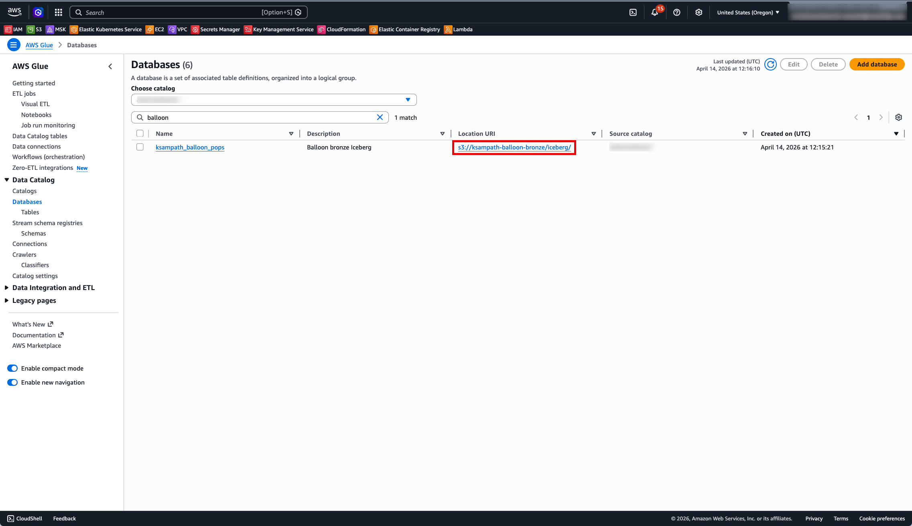
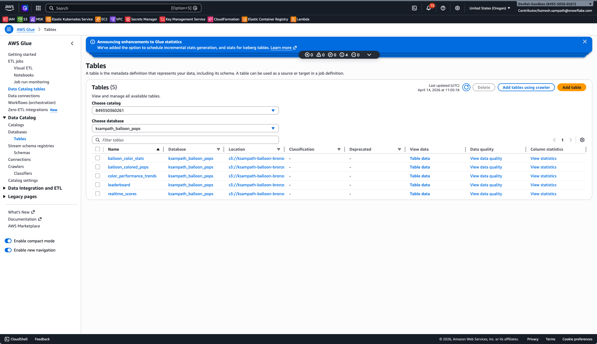
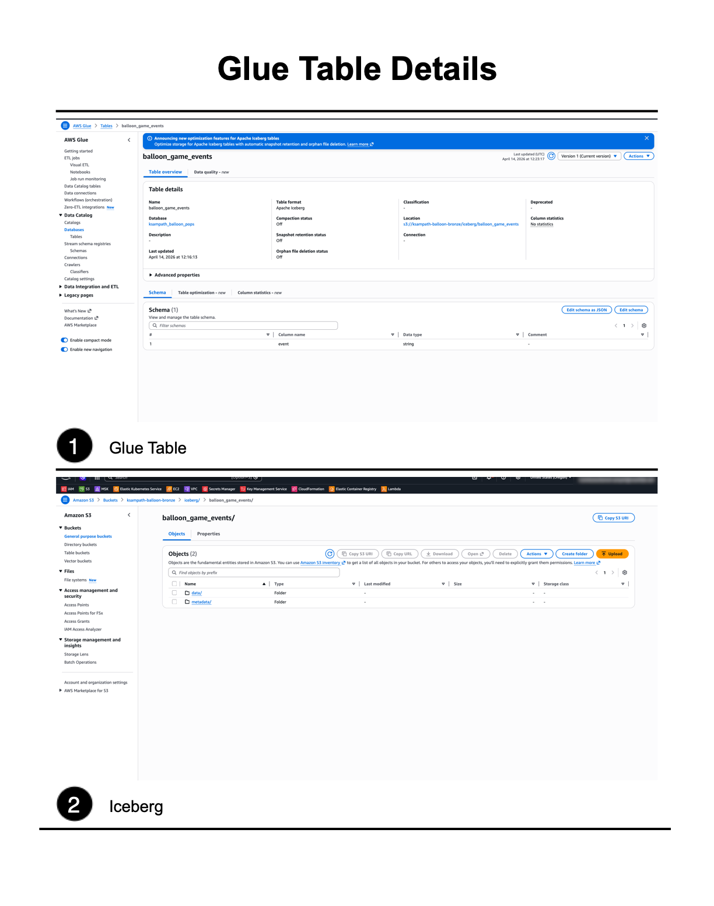

author: Kamesh Sampath, Gilberto Hernandez
id: lakehouse-iceberg-production-pipelines
categories: snowflake-site:taxonomy/solution-center/certification/quickstart,snowflake-site:taxonomy/product/data-engineering,snowflake-site:taxonomy/product/analytics
language: en
summary: Stop pipeline sprawl and the cost of data duplication. In this advanced lab, you will learn to perform secure, in-place transformations across your entire data estate. You will connect externally managed Iceberg tables with Catalog Linked Databases to always work on fresh data without ETL, build efficient and declarative pipelines with Dynamic Tables for Iceberg preserving multi-engine access to your data, and implement business continuity to ensure your production data is always available.
environments: web
status: Published
feedback link: https://github.com/Snowflake-Labs/sfguides/issues

# Lakehouse Transformations: Build Production Pipelines for your Iceberg Tables

## Overview

This quickstart shows how to build a bronze-to-silver Iceberg pipeline with AWS and Snowflake, without introducing a separate ETL copy into a second storage system. You first prepare a bronze Iceberg landing zone in AWS (Glue catalog, S3 warehouse, and optional S3 Tables control plane), then connect Snowflake to the same catalog and continue with Catalog Linked Databases and Dynamic Iceberg Tables.

The guide is intentionally bronze-first so learners can see exactly what data exists before running Snowflake catalog integration SQL.

### What You'll Learn

- How to prepare a workshop-safe bronze layer on AWS using Glue, S3, and task-driven automation.
- How Snowflake uses catalog integration and linked catalogs to query externally managed Iceberg metadata.
- How to evolve bronze data into production-friendly Dynamic Iceberg Tables and analytics surfaces.

### What You'll Build

You will build a working lakehouse workflow where bronze Iceberg tables are created and loaded in AWS, then consumed and transformed in Snowflake. The end state is a repeatable pattern for cross-engine Iceberg access with Snowflake-managed transformation layers.

### Prerequisites

- Access to a [Snowflake account](https://signup.snowflake.com/?utm_source=snowflake-devrel&utm_medium=developer-guides&utm_cta=developer-guides)
- Access to an AWS account with permissions for Glue, S3, and S3 Tables (if you run that optional control-plane setup)
- Local environment with `uv`, `task`, and AWS CLI available on `PATH`

## Tools and prerequisites

### Accounts and permissions

- AWS account and profile (`AWS_PROFILE`) that can create/update Glue database metadata and access your bronze S3 warehouse bucket.
- Snowflake account with permissions to create catalog integration and linked database objects in your target role/database.

### Local toolchain

From the repository root:

```bash
uv sync
task check-tools
```

`task check-tools` validates required CLIs for this lab flow (`aws`, `snow`, `task`, `envsubst`, `jq`, `cortex`, `uv`) and recommended helpers (`direnv`, `curl`, `openssl`).

### Environment inputs

Use `.env.example` as your source of truth, then set values in `.env` (never commit `.env`):

| Variable | Used by | Why it matters |
|----------|---------|----------------|
| `AWS_PROFILE` | all bronze tasks | Selects real AWS credentials for Glue/S3/S3 Tables actions |
| `AWS_REGION` | all bronze tasks | Keeps Glue, S3, and S3 Tables API calls in the intended region |
| `LAB_USERNAME` | `bronze-cli` derivation logic | Derives `GLUE_DATABASE` when unset; prefixes `BRONZE_BUCKET_NAME` / `BRONZE_S3TABLES_BUCKET_NAME` for shared AWS workshops |
| `BRONZE_BUCKET_NAME` | `task bronze:glue-setup`, `task bronze:load`, `task bronze:render-iam` | General-purpose S3 bucket; with `LAB_USERNAME`, defaults to `<slug>-balloon-bronze` or `<slug>-<suffix>`; Iceberg uses `s3://<bucket>/iceberg/` (printed after `glue-setup`). IAM policy ARN is always derived from this bucket. |
| `GLUE_DATABASE` (optional) | `task bronze:glue-setup`, `task bronze:load` | Overrides derived/default Glue DB name |
| `BRONZE_LOAD_DURATION_MINUTES` (optional) | `task bronze:load`, `task bronze:load-more` | Generator replay length when not using row mode (default **5** min) |
| `BRONZE_GENERATOR_DELAY` / `DELAY` (optional) | `task bronze:load` | Seconds between simulated pops (same as Kafka generator; default **1.0**) |
| `BRONZE_SAMPLE_ROW_COUNT` (optional) | `task bronze:load`, `task bronze:load-more` | If set, **synthetic** mode: same row count per table (cap **100000**); use `uv run load-bronze-sample --row-count N` or `--duration-minutes M` on CLI |
| `BRONZE_S3TABLES_BUCKET_NAME` | `task bronze:s3tables-setup` | S3 Tables bucket; empty + `LAB_USERNAME` → `<slug>-balloon-s3tables` (same suffix pattern as warehouse bucket) |
| `S3TABLES_NAMESPACE` (optional) | `task bronze:s3tables-setup` | Namespace created/managed inside the S3 Tables bucket (default `balloon_pops`) |
| *(optional)* | `task bronze:snowflake-summary`, `task bronze:snowflake-summary-json` | Read-only: resolved ARNs, Glue REST URI, and table names for Snowflake catalog / CLD prep (same env as other bronze tasks; JSON variant needs no `task … --` forwarding). |

### Task and script entrypoints

Bronze automation uses `task bronze:*` and Python entrypoints declared in `pyproject.toml`:

- `uv run bronze-cli ...`
- `uv run load-bronze-sample`

For command details and expected outputs, see `tools/bronze_preload/README.md`.

## Bronze landing zone

This section is the first hands-on chapter because all downstream Snowflake steps assume these tables already exist.

### Run bronze setup

Use these tasks in order (or `task bronze:all` once prerequisites are in place):

```bash
task bronze:render-iam          # optional policy render helper
task bronze:glue-setup
task bronze:s3tables-setup
task bronze:load
```

Dry-run variants are available to preview behavior:

```bash
task bronze:render-iam-dry-run
task bronze:glue-setup-dry-run
task bronze:s3tables-setup-dry-run
```

### Verify what you have

After bronze setup (and before Snowflake catalog integration SQL), you can run **`task bronze:snowflake-summary`** for a copy-paste sheet of exports and ARNs, or **`task bronze:snowflake-summary-json`** for the same payload as JSON. This does not modify AWS; it uses your current `.env` and optional live S3 Tables lookups.

You should have this raw-events Iceberg table in your Glue database (same logical stream as `balloon_game_events` in `polaris-forge-setup/templates/source.sql.j2`). Rows use a single JSON payload column **`event`** (Kafka-style one object per row); Snowflake Dynamic Iceberg Tables use **`PARSE_JSON`** / semi-structured paths to mirror the template MVs—see **`snowflake/lab/REFERENCE.md`** in this repo.

- `balloon_game_events`

Full console steps (Glue + S3 warehouse + S3 Tables) live in **`lab/bronze-landing-zone.md`**. The quickstart embeds screenshots from this guide’s **`assets/`** folder (Snowflake Quickstarts convention). Author captures under **`lab/images/`**, then copy PNGs into **`assets/`** — see **`assets/README.md`**.

#### Verify in the AWS Console (screenshots)

Use the same account and **`AWS_REGION`** as your CLI profile.

**Glue + general S3 warehouse** (after **`task bronze:load`**):

1. **Glue** → **Data catalog** → **Databases** — confirm **`GLUE_DATABASE`** exists.
2. Open that database → **Tables** — confirm **`balloon_game_events`**.
3. Open **`balloon_game_events`** — confirm **Apache Iceberg**.
4. **S3** → warehouse bucket **`BRONZE_BUCKET_NAME`** — confirm the bucket; optional: open **`iceberg/`** and capture `metadata/` / `data/` when you add **`assets/bronze-s3-iceberg-prefix.png`**.

**Amazon S3 Tables** (after **`task bronze:s3tables-setup`**): open **S3 Tables** → **Table buckets** and confirm **`BRONZE_S3TABLES_BUCKET_NAME`** appears. Default **`bronze:load`** writes to the Glue-backed S3 warehouse above; S3 Tables is the second Iceberg surface for Snowflake / Glue REST alignment (see **`lab/bronze-landing-zone.md`**).









### Optional: Query bronze in Amazon Athena

To run SQL on the **loaded** Iceberg tables, use the **Glue** catalog where **`task bronze:load`** registered them—not the **S3 Tables** catalog entry (those tables are empty shells until a separate writer commits metadata). See [Query Apache Iceberg tables](https://docs.aws.amazon.com/athena/latest/ug/querying-iceberg.html) in the Athena documentation.

1. **Data source:** **`AwsDataCatalog`**.
2. **Catalog:** leave **default** / **None** (or choose the account’s native Glue catalog). **Do not** select **`s3tables/<table-bucket>`** in the Catalog dropdown—that path is the S3 Tables federated catalog and will return errors such as missing **`metadata_location`** for this lab’s seed data.
3. **Database:** your **`GLUE_DATABASE`** from bronze (for example **`ksampath_balloon_pops`** when **`LAB_USERNAME`** derived it). It is usually **`<glue_slug>_balloon_pops`**, not the literal **`balloon_pops`** string alone—that name is often the **S3 Tables namespace** (`S3TABLES_NAMESPACE`), which is a different object. Confirm with **`task bronze:snowflake-summary`** or **`Name`** in **`.aws-config/glue-database.json`**.

More detail and troubleshooting: [Athena (and other SQL clients)](../lab/bronze-landing-zone.md#athena-and-other-sql-clients) in **`lab/bronze-landing-zone.md`**.

Use this detailed runbook for full step-by-step setup, validation, and troubleshooting:

- `lab/bronze-landing-zone.md`
- `lab/bronze-landing-zone-MANUAL-TEST.md`

In the next phase, this guide will add Snowflake catalog integration and linked database sections that consume the bronze objects created here.

## TODO (WIP)

- Add one consolidated **Cleanup** section at the end of the full guide (covering bronze and Snowflake resources) instead of adding cleanup after each section.
